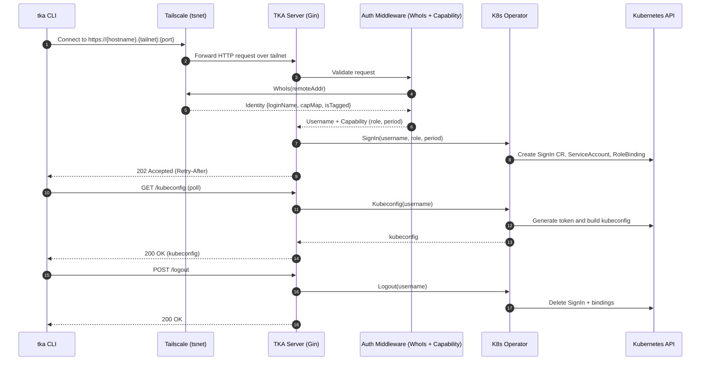

### Overview

TKA builds on Tailscale’s identity and transport to authenticate users and gate access to Kubernetes. Access is granted via short-lived, scoped credentials that are provisioned on demand and cleaned up automatically.

### Core principles

- Network identity first: requests must arrive over the tailnet
- Capability-based authorization: Tailscale ACL capabilities define role and validity period
- Ephemeral credentials: per-user ServiceAccounts with short-lived tokens
- Kubernetes-native RBAC: roles are bound using standard RBAC

### Components and trust

- TKA Server: terminates HTTP over tsnet, enforces identity via WhoIs, requires a specific ACL capability
- Auth Middleware: rejects Funnel traffic; extracts username and capability
- Auth Service: delegates to the operator for provisioning
- K8s Operator: creates and deletes ServiceAccounts/RoleBindings; generates tokens; never stores secrets outside the cluster

### Data flow

### Why this design

- Leverages Tailscale for mutual auth and device/user identity; no extra ingress or OIDC setup
- Keeps Kubernetes as source of truth for authorization, using RBAC
- Uses short-lived credentials to reduce blast radius and credential sprawl
- Explicit capability name binds ACL policy to the service, avoiding accidental privilege bleed

### Threat considerations

- Funnel traffic is rejected to prevent off-tailnet access
- Tagged nodes are currently denied to avoid ambiguous identity semantics
- Capability JSON is validated; multiple rules for a user are rejected
- Tokens are generated on demand and not persisted by the server
- Logs include trace IDs; metrics are exposed separately under `/metrics/controller`

### Configuration knobs that affect security

- `tailscale.capName`: capability to require from ACLs
- `operator.namespace`: where ServiceAccounts and SignIn resources are created
- `api.retryAfterSeconds`: polling guidance only; not a security control
- Timeouts (read/write/idle): apply to HTTP server behavior
