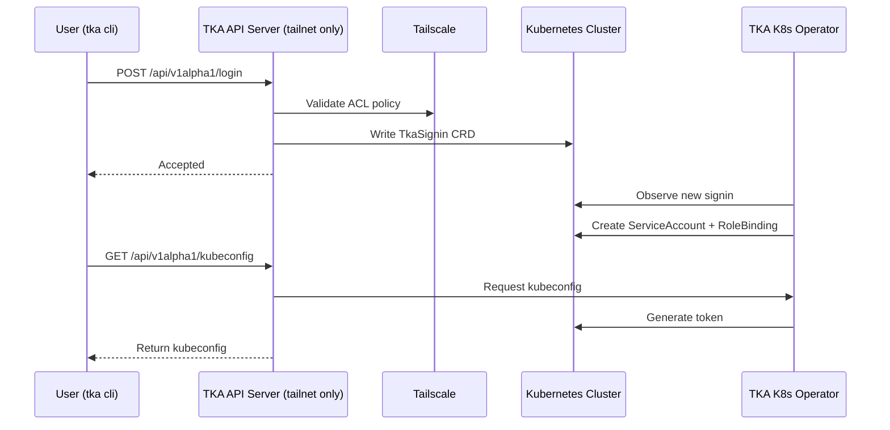

TKA is designed to bridge **Tailscale identity** with **Kubernetes RBAC** using
**ephemeral ServiceAccounts** and **short‑lived tokens**.

This page explains the *why* and *how* of the architecture, so you can
understand the moving parts and their responsibilities.

## The Big Picture

At a high level, TKA has three main components:

- **TKA Server** → the entrypoint for users, running inside your tailnet
- **TKA Operator** → a Kubernetes controller that provisions and cleans up ephemeral credentials
- **TKA CLI** → the user‑facing tool that makes authentication feel seamless

Together, they form a loop:

1. A user authenticates via the CLI.
2. The server validates identity and writes a `TkaSignin` resource.
3. The operator reconciles that resource into a ServiceAccount + RBAC binding.
4. The CLI fetches a kubeconfig with a short‑lived token.

## Why This Design?

- **Ephemeral by default** → credentials expire automatically, reducing risk
- **Network‑gated** → only accessible inside your tailnet, no public ingress
- **Kubernetes‑native** → uses ServiceAccounts and RBAC, no custom auth layer
- **Separation of concerns** → server handles identity, operator handles Kubernetes resources

This separation keeps the server stateless and auditable, while the operator
owns the lifecycle of in‑cluster resources.

## Component Roles

### TKA Server

- Runs inside the tailnet, exposes an HTTP API
- Authenticates users via Tailscale WhoIs + ACLs
- Writes `TkaSignin` resources into the cluster
- Returns kubeconfigs with ephemeral tokens

### TKA Operator

- Watches for `TkaSignin` resources
- Creates/deletes ServiceAccounts and RoleBindings
- Generates tokens and cleans up expired sessions

### TKA CLI

- Provides a simple UX (`tka login`, `tka shell`)
- Talks to the server, manages kubeconfigs
- Makes ephemeral access feel like a normal `kubectl` workflow

## How It Fits Together

Think of TKA as a **bridge**:

- On one side: Tailscale provides *who you are* (device + user identity).
- On the other: Kubernetes enforces *what you can do* (RBAC).
- In the middle: TKA glues them together with short‑lived credentials.

## Where to Go Next

- For **implementation details** (API endpoints, CLI commands, config knobs), see the [Developer Reference](../reference/).
- For **security considerations**, see the [Security Model](./security.md).
- For **deployment guidance**, see the [Production Deployment How‑To](../how-to/deploy-production.md).
