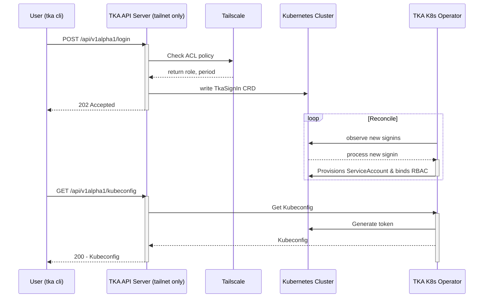

:::note Security Notice
This project’s security model is still **experimental**.

I’ve designed it with care, but I’m not a professional security auditor or
pentester. While it should be reasonably safe for most use cases, it’s not guaranteed to be bullet‑proof.

If you need **strong, production‑grade security**, consider using a professionally reviewed solution.

For more details, see the [Security Model documentation](security.md).
:::

## How it works on a high level

1. A TKA server runs inside your Kubernetes cluster and exposes an HTTP API over your [Tailscale] _[tailnet]_.
   - Since the API is only available via your [tailnet], the only users who can reach the API endpoint are already trusted due to their membership in your [tailnet] and explicit ACLs allowing them access to the API endpoint via a [Tailscale ACL grant]
2. Incoming requests are resolved to the User who is performing the request and authorized by the capability in your ACL, naming a role and validity period.
3. The TKA operator running in your cluster provisions a short-lived [ServiceAccount] and binds appropriate [RBAC].
4. The server returns a kubeconfig that uses the ephemeral token
5. The operator cleans up resources on logout or expiry.

[Tailscale]: https://tailscale.com
[tailnet]: https://tailscale.com/kb/1136/tailnet
[Tailscale ACL grant]: https://tailscale.com/kb/1324/grants
[ServiceAccount]: https://kubernetes.io/docs/concepts/security/service-accounts/
[RBAC]: https://kubernetes.io/docs/reference/access-authn-authz/rbac/

### Sequence Diagram

You can find more details about the request flows in the [Developer Documentation: Request Flows]

[Developer Documentation: Request Flows]: ../reference/developer/request-flows.md

## Why this model

- Inspired by how [`tsidp`] uses your Tailscale identity for OIDC, but for K8s identity
- Uses short-lived credentials to reduce blast radius and simplify revocation
- Keeps Kubernetes as the source of truth for authorization via standard RBAC
- Easy auditing by checking the currently active ServiceAccounts / ClusterRoleBindings

[`tsidp`]: https://github.com/tailscale/tailscale/tree/ed6aa50bd549bdc5e79dcf0326c358f40e9aced2/cmd/tsidp

### What about [Teleport]?

[Teleport]: https://goteleport.com

We love [Teleport][gh-teleport] dearly, and it was a major inspiration for this project.
It's a robust, production-proven system that handles multi-protocol access with powerful SSO, audit, and session recording features.

[gh-teleport]: https://github.com/gravitational/teleport

That said, we needed something just for Kubernetes, something much lighter weight, and most importantly, something that works with our existing Tailscale setup. Why have two ZTNA systems that provide _almost_ the same features, when you can go out of your way to waste time building your own thing, learn a ton in the process, and make it integrate better into your existing setup?

### What about [Tailscale's API server proxy]

[Tailscale's API server proxy]: https://tailscale.com/kb/1437/kubernetes-operator-api-server-proxy

Tailscale’s Kubernetes Operator is a fantastic way to access your Kubernetes cluster over the tailnet.
It can proxy requests to the Kubernetes API and impersonate users or groups based on tailnet identity, allowing you to define fine-grained access via standard Kubernetes RBAC.
It’s a great fit for many use cases.

However, we wanted a different model of access.
Our idea around access is about dynamically provisioning ephemeral Service Accounts for users, with the Cluster Role Bindings configured via the tailscale ACL file.
With `tka`, we can define ephemeral access with zero-permission-by-default but still tie in to a kube-native experience.
