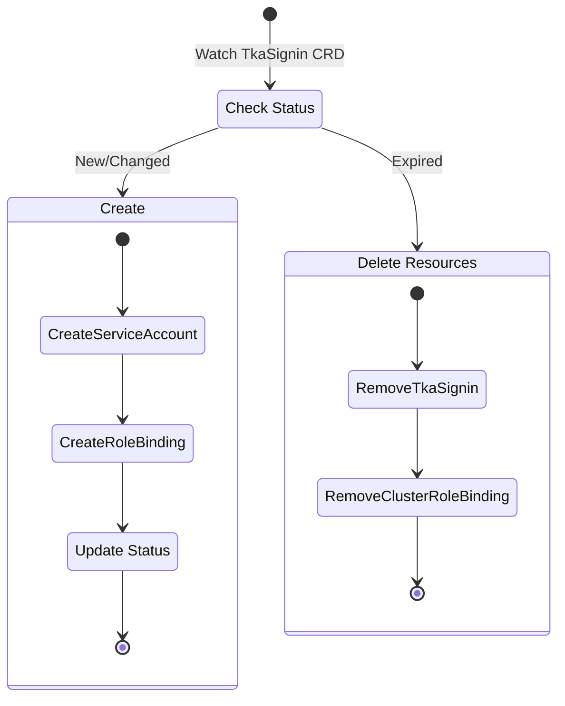

This page provides a **developer‑oriented view** of TKA’s architecture.

It describes the components, APIs, resources, and control flows in detail.

## System Components

### 1. TKA Server

**Responsibilities**:

- Expose REST API over `tsnet` (tailnet‑only)
- Authenticate users via a dedicated Gin middleware that integrates with Tailscale `WhoIs`. The middleware extracts the username and capability from the request context before passing control to the handlers. (See [Request Flows: Tailscale Auth Middleware])
- Validate ACL capabilities (role + validity period)
- Write `TkaSignin` CRDs into the Kubernetes cluster
- Return kubeconfigs with ephemeral ServiceAccount tokens

[Request Flows: Tailscale Auth Middleware]: ./request-flows.md#tailscale-auth-middleware

**Implementation**:

- **Networking**: [`tsnet`](./tailscale-server.md)
- **HTTP**: Gin router + [middleware][Request Flows: Tailscale Auth Middleware]
- **Kubernetes API**: `client-go`
- **Observability**: OpenTelemetry (traces, metrics, logs)

**Deployment**:

- Runs as a Kubernetes Deployment
- Stateless (no DB; persistence via Kubernetes API)

**API Endpoints**:

- `POST /api/v1alpha1/login` → authenticate user, create `TkaSignin`
- `GET /api/v1alpha1/kubeconfig` → return kubeconfig for active session
- `POST /api/v1alpha1/logout` → revoke session

### 2. TKA Operator (Controller)

**Responsibilities**:

- Watch `TkaSignin` CRDs
- Create/delete ServiceAccounts
- Bind ClusterRoles/Roles via RoleBindings
- Generate ServiceAccount tokens
- Clean up expired resources

**Implementation**:

- **Framework**: `controller-runtime`
- **Custom Resource**: `TkaSignin`
- **RBAC**: ServiceAccount + RoleBinding management
- **Metrics**: exposed at `/metrics/controller`

**Reconciliation Flow**:



### 3. TKA CLI

**Responsibilities**:

- Provide user‑facing commands (`login`, `logout`, `shell`, etc.)
- Construct API requests to TKA Server
- Manage kubeconfig files
- Integrate with shell environments
- Display session information

**Command Tree**:

```text
tka
├── login          # Authenticate and get kubeconfig
├── logout         # Revoke access and cleanup
├── shell          # Start subshell with temp access
├── kubeconfig     # Fetch current kubeconfig
├── reauthenticate # Refresh credentials
├── get            # Status and information commands
│   ├── login      # Show current login status
│   └── kubeconfig # Alias for kubeconfig command
└── integration    # Generate shell integration code
```

> [!TIP]
> Check out the full [CLI Reference](../cli.md) that is auto generated using the Cobra documentation of each command

## Resource Model

### Custom Resource: `TkaSignin`

Represents a user session request.

**Spec fields**:

- `username`: Tailscale user identity
- `capability`: ACL capability name
- `ttl`: requested session duration

**Status fields**:

- `phase`: Pending | Active | Expired
- `serviceAccount`: name of provisioned SA
- `expiry`: timestamp

### Resource Naming Conventions

- **ServiceAccount**: `tka-user-{sanitized-username}`
  Example: `tka-user-alice`

- **ClusterRoleBinding**: `{serviceAccount}-binding`
  Example: `tka-user-alice-binding`

- **TkaSignin**: `tka-user-{sanitized-username}`
  Example: `tka-user-alice`

## Configuration

### Hierarchy

1. Command flags (highest priority)
2. Environment variables (`TKA_` prefix)
3. Config file (`config.yaml`)
4. Defaults (hardcoded)

### Config File Search Order

1. `--config` flag
2. `./config.yaml`
3. `$HOME/config.yaml`
4. `$HOME/.config/tka/config.yaml`
5. `/data/config.yaml`

## Observability

### Metrics

**Server (`/metrics`)**:

- HTTP request rate, latency, error counts
- Authentication success/failure
- Token generation counts

**Operator (`/metrics/controller`)**:

- Reconciliation rate and latency
- Resource creation/deletion counters
- Error rates by operation type

### Logging

- Structured JSON logs
- Trace IDs for correlation
- Levels: ERROR, WARN, INFO, DEBUG

### Tracing

- OpenTelemetry spans across server + operator
- Request flow visibility
- Performance bottleneck identification
