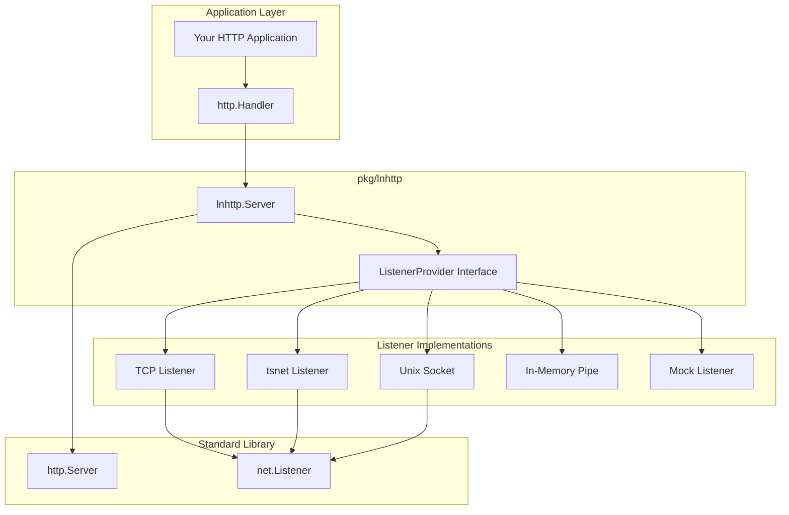

The [`pkg/lnhttp`](https://github.com/SpechtLabs/tka/tree/main/pkg/lnhttp) package provides a thin abstraction layer over Go's standard `http.Server` that decouples listener creation from server operation. This enables pluggable listener implementations (like Tailscale's tsnet) while maintaining full compatibility with the standard HTTP server interface.

**Go Documentation**: [pkg.go.dev/github.com/spechtlabs/tka/pkg/lnhttp](https://pkg.go.dev/github.com/spechtlabs/tka/pkg/lnhttp)

## Overview

This package solves the problem of testing and abstracting HTTP servers that need custom network listeners. Instead of being tied to TCP listeners, applications can inject any listener implementation.

**Key Benefits:**

- **Listener Abstraction**: Decouple server logic from network layer
- **Testing Support**: Easy mocking of network connections
- **Custom Protocols**: Support for tsnet, Unix sockets, in-memory pipes, etc.
- **Standard Interface**: Drop-in replacement for `http.Server`

## Architecture



## Core Types

### ListenerProvider Interface

The core abstraction that enables pluggable listeners:

```go
type ListenerProvider interface {
    Listen(ctx context.Context, network string, address string) (net.Listener, error)
}
```

This interface abstracts the `net.Listen` function, allowing custom implementations for different networking backends.

### Server

The main server type that wraps `http.Server` with pluggable listeners:

```go
type Server struct {
    *http.Server           // Embedded standard HTTP server
    Provider ListenerProvider  // Pluggable listener implementation
}
```

The server embeds `http.Server`, so all standard methods and fields are available.

## API Reference

### Constructor

#### NewServer

```go
func NewServer(s *http.Server, provider ListenerProvider) *Server
```

Creates a new lnhttp server with the provided HTTP server and listener provider.

**Parameters:**

- `s`: Standard `http.Server` instance (can be `nil` for defaults)
- `provider`: Implementation of `ListenerProvider` interface

**Returns:** A configured `*Server` ready to serve HTTP traffic

**Example:**

```go
// Create with default http.Server
server := lnhttp.NewServer(nil, myProvider)

// Create with custom http.Server
httpSrv := &http.Server{
    ReadTimeout:  30 * time.Second,
    WriteTimeout: 60 * time.Second,
}
server := lnhttp.NewServer(httpSrv, myProvider)
```

### Server Methods

#### Serve

```go
func (s *Server) Serve(ctx context.Context, handler http.Handler) error
```

Starts the HTTP server using a listener obtained from the provider.

**Parameters:**

- `ctx`: Context for listener creation (not server lifecycle)
- `handler`: HTTP handler to serve requests

**Returns:** `error` if listener creation or serving fails

**Behavior:**

1. Calls `Provider.Listen(ctx, "tcp", s.Addr)` to get a listener
2. Sets the handler on the embedded `http.Server`
3. Calls `http.Server.Serve(listener)` to start serving
4. Returns `nil` when server shuts down normally

**Example:**

```go
handler := http.HandlerFunc(func(w http.ResponseWriter, r *http.Request) {
    fmt.Fprintf(w, "Hello, World!")
})

if err := server.Serve(ctx, handler); err != nil {
    log.Fatal("Server failed:", err)
}
```

#### ListenAndServe

```go
func (s *Server) ListenAndServe() error
```

Standard library compatible method that uses the embedded server's handler and a background context.

**Returns:** `error` if listener creation or serving fails

**Example:**

```go
server.Handler = myHandler
if err := server.ListenAndServe(); err != nil {
    log.Fatal("Server failed:", err)
}
```

#### Shutdown

```go
func (s *Server) Shutdown(ctx context.Context) error
```

Gracefully shuts down the server by delegating to the embedded `http.Server`.

**Parameters:**

- `ctx`: Context with timeout for shutdown

**Returns:** `error` if shutdown fails

**Example:**

```go
shutdownCtx, cancel := context.WithTimeout(context.Background(), 30*time.Second)
defer cancel()

if err := server.Shutdown(shutdownCtx); err != nil {
    log.Printf("Shutdown failed: %v", err)
}
```

## Listener Provider Implementations

### TCP Provider

Standard TCP listener implementation:

```go
type TCPProvider struct{}

func (p *TCPProvider) Listen(ctx context.Context, network, address string) (net.Listener, error) {
    return net.Listen(network, address)
}
```

### tsnet Provider

Tailscale networking provider (used by `pkg/tailscale`):

```go
type TSNetProvider struct {
    ts *tsnet.Server
}

func (p *TSNetProvider) Listen(ctx context.Context, network, address string) (net.Listener, error) {
    return p.ts.Listen(network, address)
}
```

### Unix Socket Provider

Unix domain socket implementation:

```go
type UnixProvider struct {
    socketPath string
}

func (p *UnixProvider) Listen(ctx context.Context, network, address string) (net.Listener, error) {
    return net.Listen("unix", p.socketPath)
}
```

## Usage Patterns

### Basic HTTP Server

```go
package main

import (
    "context"
    "fmt"
    "net"
    "net/http"
    "time"

    "github.com/spechtlabs/tka/pkg/lnhttp"
)

// Simple TCP provider
type tcpProvider struct{}

func (p *tcpProvider) Listen(ctx context.Context, network, address string) (net.Listener, error) {
    return net.Listen(network, address)
}

func main() {
    // Create HTTP server
    httpSrv := &http.Server{
        Addr:         ":8080",
        ReadTimeout:  30 * time.Second,
        WriteTimeout: 60 * time.Second,
    }

    // Create lnhttp server with TCP provider
    server := lnhttp.NewServer(httpSrv, &tcpProvider{})

    // Define handler
    handler := http.HandlerFunc(func(w http.ResponseWriter, r *http.Request) {
        fmt.Fprintf(w, "Hello from lnhttp server!")
    })

    // Start server
    ctx := context.Background()
    if err := server.Serve(ctx, handler); err != nil {
        panic(err)
    }
}
```

### Testing with Mock Provider

```go
package main

import (
    "context"
    "net"
    "testing"

    "github.com/spechtlabs/tka/pkg/lnhttp"
    "github.com/stretchr/testify/require"
)

// Mock provider for testing
type mockProvider struct {
    listener net.Listener
    err      error
}

func (p *mockProvider) Listen(ctx context.Context, network, address string) (net.Listener, error) {
    return p.listener, p.err
}

func TestServer_WithMockProvider(t *testing.T) {
    // Create pipe listener for testing
    clientConn, serverConn := net.Pipe()
    defer clientConn.Close()
    defer serverConn.Close()

    // Mock listener that returns the server side of pipe
    mockListener := &mockListener{conn: serverConn}
    provider := &mockProvider{listener: mockListener}

    // Create server
    server := lnhttp.NewServer(nil, provider)

    // Test handler
    handler := http.HandlerFunc(func(w http.ResponseWriter, r *http.Request) {
        w.WriteHeader(http.StatusOK)
        w.Write([]byte("test response"))
    })

    // Start server in goroutine
    go func() {
        server.Serve(context.Background(), handler)
    }()

    // Send request via client side of pipe
    // ... test implementation ...
}
```

### Production Server with Custom Provider

```go
func createProductionServer() *lnhttp.Server {
    // Production HTTP configuration
    httpSrv := &http.Server{
        ReadTimeout:       30 * time.Second,
        ReadHeaderTimeout: 10 * time.Second,
        WriteTimeout:      60 * time.Second,
        IdleTimeout:       300 * time.Second,
        Addr:             ":443",
    }

    // Custom provider (could be tsnet, unix socket, etc.)
    provider := &customNetworkProvider{
        // ... provider configuration ...
    }

    return lnhttp.NewServer(httpSrv, provider)
}
```

### Graceful Shutdown Pattern

```go
func runServerWithShutdown(server *lnhttp.Server, handler http.Handler) {
    // Server context
    serverCtx, serverCancel := context.WithCancel(context.Background())
    defer serverCancel()

    // Start server
    serverErr := make(chan error, 1)
    go func() {
        serverErr <- server.Serve(serverCtx, handler)
    }()

    // Wait for interrupt
    sigCh := make(chan os.Signal, 1)
    signal.Notify(sigCh, os.Interrupt, syscall.SIGTERM)

    select {
    case err := <-serverErr:
        log.Printf("Server error: %v", err)
    case <-sigCh:
        log.Println("Shutting down server...")

        // Graceful shutdown
        shutdownCtx, cancel := context.WithTimeout(context.Background(), 30*time.Second)
        defer cancel()

        if err := server.Shutdown(shutdownCtx); err != nil {
            log.Printf("Shutdown error: %v", err)
        }
    }
}
```

## Testing Support

The `lnhttp` package makes testing HTTP servers much easier by allowing mock listeners:

### In-Memory Testing

```go
type pipeProvider struct {
    listener *pipeListener
}

type pipeListener struct {
    connCh chan net.Conn
}

func (l *pipeListener) Accept() (net.Conn, error) {
    conn, ok := <-l.connCh
    if !ok {
        return nil, errors.New("listener closed")
    }
    return conn, nil
}

func (l *pipeListener) Close() error {
    close(l.connCh)
    return nil
}

func (l *pipeListener) Addr() net.Addr {
    return &net.TCPAddr{IP: net.IPv4zero, Port: 0}
}

func (p *pipeProvider) Listen(ctx context.Context, network, address string) (net.Listener, error) {
    return p.listener, nil
}
```

### Simulating Network Failures

```go
type failingProvider struct {
    failAfter time.Duration
}

func (p *failingProvider) Listen(ctx context.Context, network, address string) (net.Listener, error) {
    time.Sleep(p.failAfter)
    return nil, errors.New("simulated network failure")
}
```

## Integration with pkg/tailscale

The `pkg/tailscale` package uses `lnhttp.Server` as its foundation:

```go
// In pkg/tailscale/server.go
type Server struct {
    *lnhttp.Server  // Embedded lnhttp server

    // Tailscale-specific fields
    ts        *tsnet.Server
    hostname  string
    // ...
}

// tsnet provider implementation
type tsnetListenerProvider struct {
    ts *tsnet.Server
}

func (p *tsnetListenerProvider) Listen(ctx context.Context, network, address string) (net.Listener, error) {
    return p.ts.Listen(network, address)
}

func NewServer(hostname string, opts ...Option) *Server {
    ts := &tsnet.Server{Hostname: hostname}

    // Create lnhttp server with tsnet provider
    lnSrv := lnhttp.NewServer(&http.Server{...}, &tsnetListenerProvider{ts: ts})

    return &Server{
        Server: lnSrv,
        ts:     ts,
        // ...
    }
}
```

This design allows `tailscale.Server` to focus on Tailscale-specific concerns (identity, capabilities, security) while delegating HTTP server management to `lnhttp.Server`.

## Error Handling

### Provider Errors

If the provider's `Listen` method returns an error, `Serve` will return it immediately:

```go
if err := server.Serve(ctx, handler); err != nil {
    if strings.Contains(err.Error(), "address already in use") {
        // Handle port conflict
    } else if strings.Contains(err.Error(), "permission denied") {
        // Handle permission issues
    }
    // ... other error handling
}
```

### Server Errors

Standard `http.Server` errors are returned normally:

```go
if err := server.Serve(ctx, handler); err != nil {
    if errors.Is(err, http.ErrServerClosed) {
        // Normal shutdown
        return nil
    }
    return fmt.Errorf("server error: %w", err)
}
```

## Performance Considerations

### Listener Lifecycle

- Listeners are created once when `Serve` is called
- The same listener is used for the entire server lifetime
- Providers should handle connection pooling and resource management

### Context Usage

- Context passed to `Listen` is for listener creation only
- Server lifecycle is managed separately via `Shutdown`
- Providers should respect context cancellation during setup

## Dependencies

- **net/http**: Standard library HTTP server
- **net**: Standard library networking
- **context**: Standard library context support

**No External Dependencies**: This package only uses Go standard library components.

## Related Documentation

- [pkg/tailscale](./tailscale-server.md) - Higher-level Tailscale integration that uses this package
- [TKA Architecture](../../explanation/architecture.md) - How this fits into TKA
- [Go net/http documentation](https://pkg.go.dev/net/http) - Standard library reference
