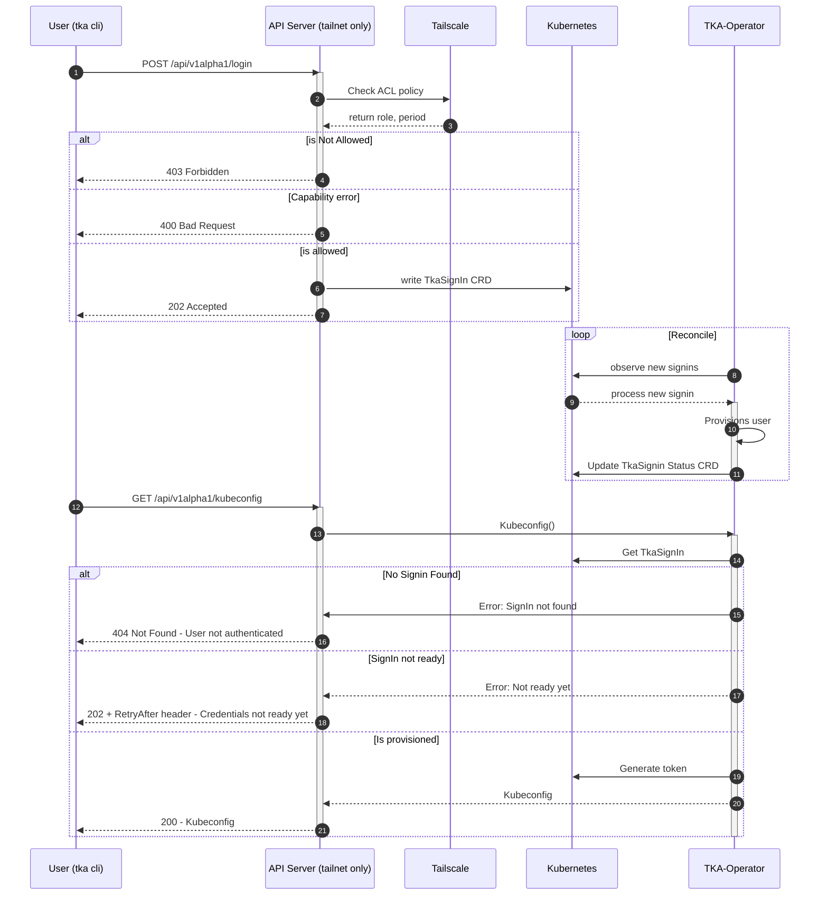
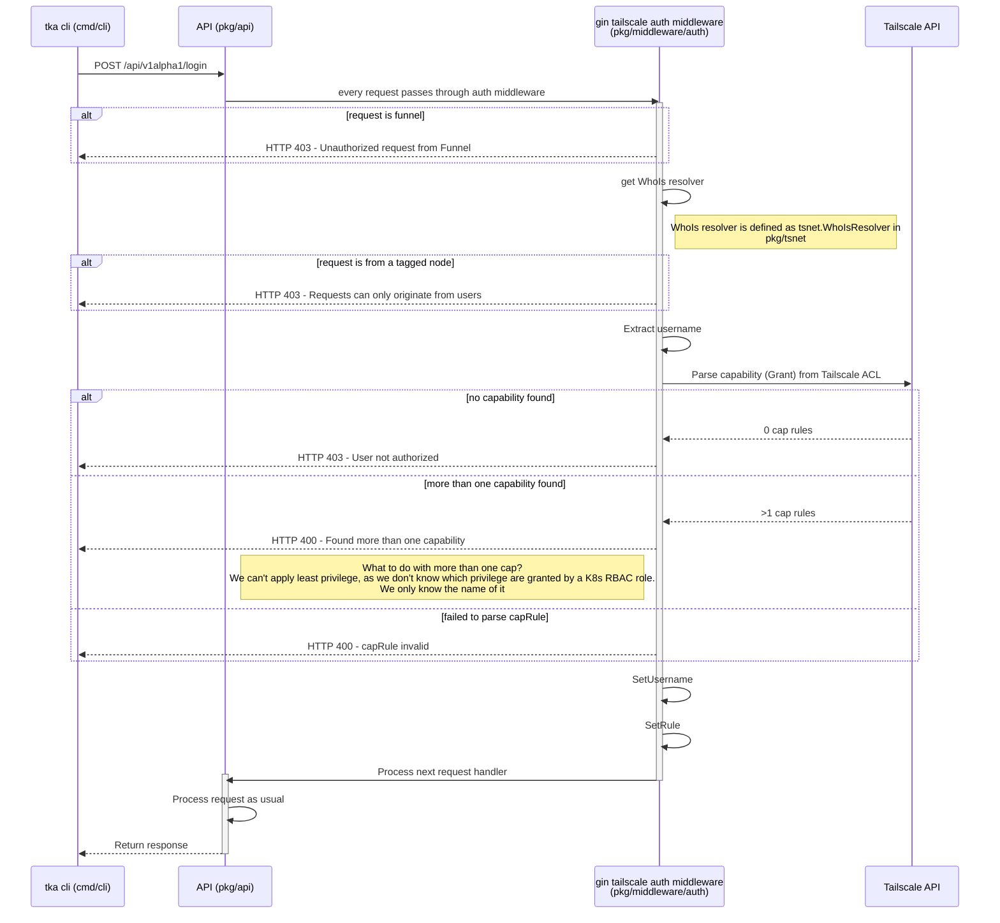
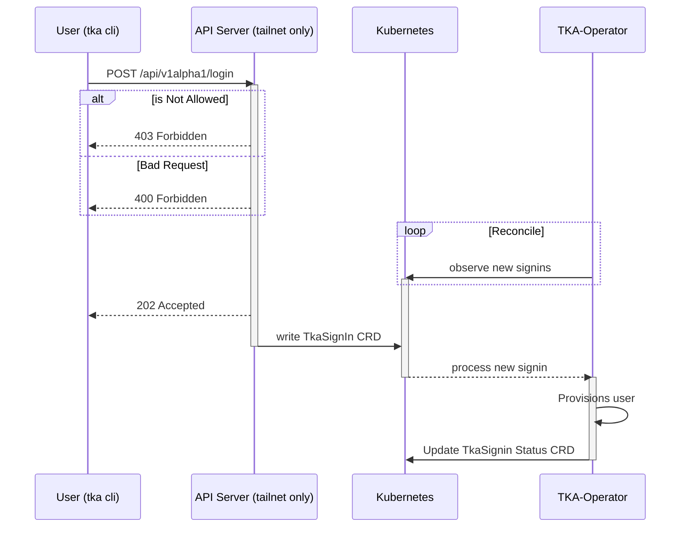
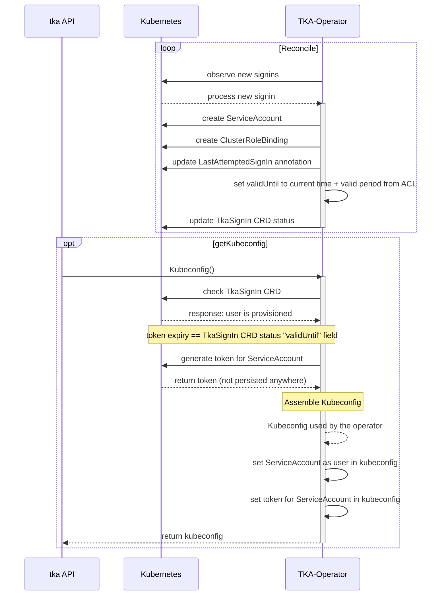
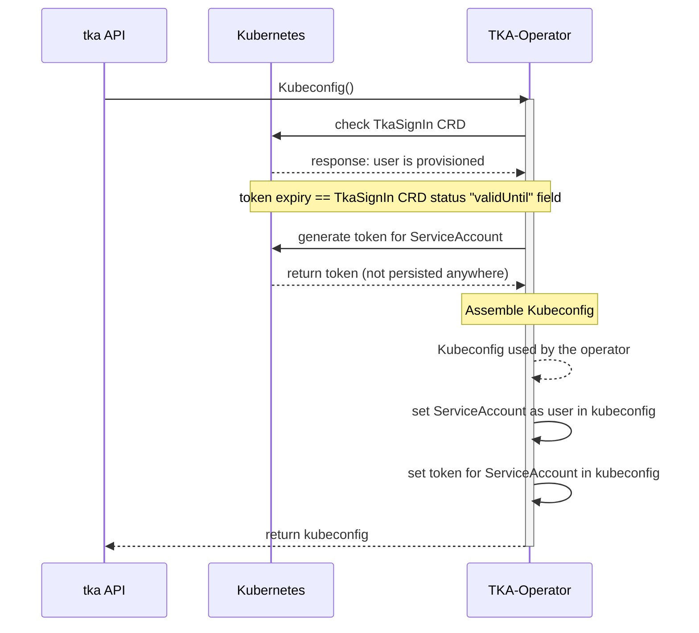
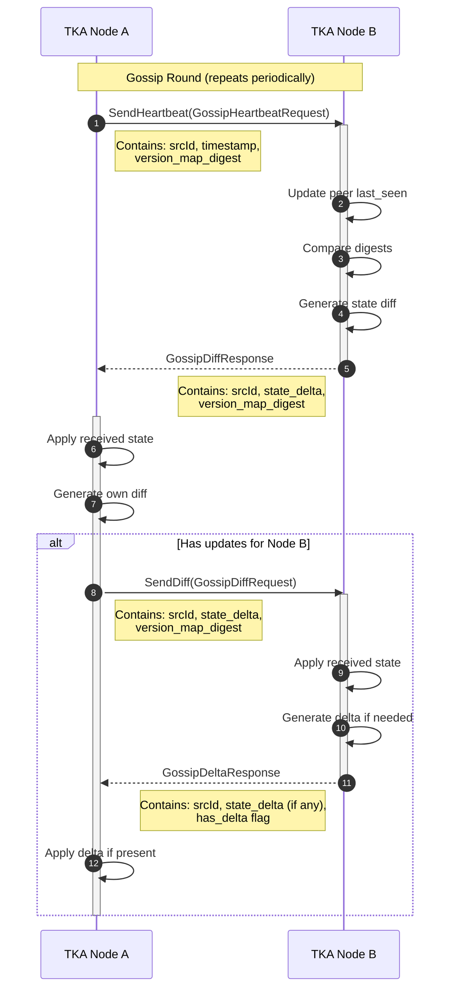
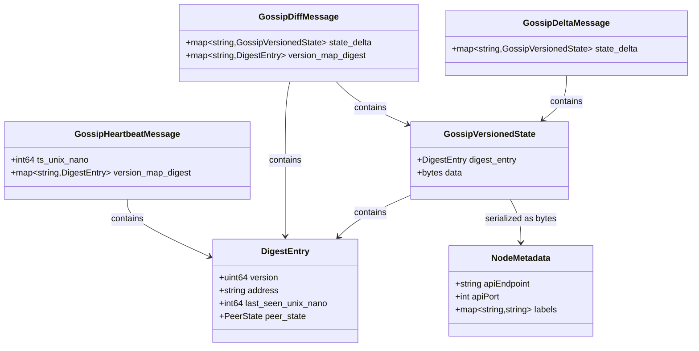
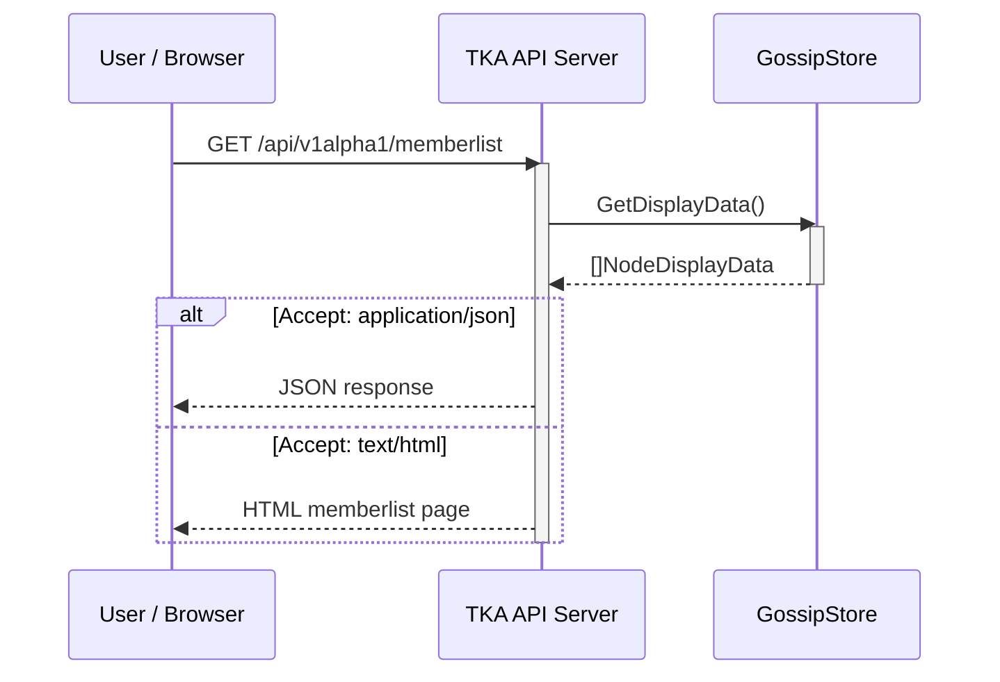

This page is here to provide more in-depth information of the request flows

## Details

### Tailscale Auth Middleware

### SignIn Request

### Provision SignIn

## Request-Flow Get Kubeconfig

## Cluster Discovery (Gossip Protocol)

TKA servers can discover each other and share cluster metadata using a gossip-based protocol. This enables multi-cluster deployments where users can discover available clusters.

### Gossip Overview

The gossip protocol uses a 3-way handshake to synchronize state between nodes:

1. **Heartbeat**: Node A sends its version digest to Node B
2. **Diff**: Node B responds with state differences and its own digest
3. **Delta**: Node A sends any remaining differences to complete sync

### Data Exchanged

Each TKA node shares its **NodeMetadata** through the gossip protocol:

| Field | Type | Description |
| :--- | :--- | :--- |
| `apiEndpoint` | string | The Kubernetes API server URL for this cluster |
| `apiPort` | int | The port TKA server listens on |
| `labels` | map[string]string | Cluster labels (environment, region, etc.) |

### Gossip Message Types

### Peer States

The gossip protocol tracks the health of peers using the following states:

| State | Description |
| :--- | :--- |
| `HEALTHY` | Peer is responding normally |
| `SUSPECTED_DEAD` | Peer has missed several heartbeat cycles |
| `DEAD` | Peer has exceeded the dead threshold and will be removed |

### Gossip Configuration

| Parameter | Default | Description |
| :--- | :--- | :--- |
| `gossipFactor` | 3 | Number of peers to gossip with per cycle |
| `gossipInterval` | 1s | Time between gossip cycles |
| `stalenessThreshold` | 5 | Consecutive failures before marking peer as suspected dead |
| `deadThreshold` | 10 | Consecutive failures before removing peer |

### Memberlist API

Users can query the current cluster membership via the API:

**Response includes for each node:**

| Field | Description |
| :--- | :--- |
| `id` | Unique node identifier |
| `address` | gRPC address for gossip communication |
| `lastSeen` | Timestamp of last successful communication |
| `version` | Current state version (vector clock) |
| `state` | Serialized NodeMetadata |
| `peerState` | Health state (HEALTHY, SUSPECTED_DEAD, DEAD) |
| `isLocal` | Whether this is the local node |
