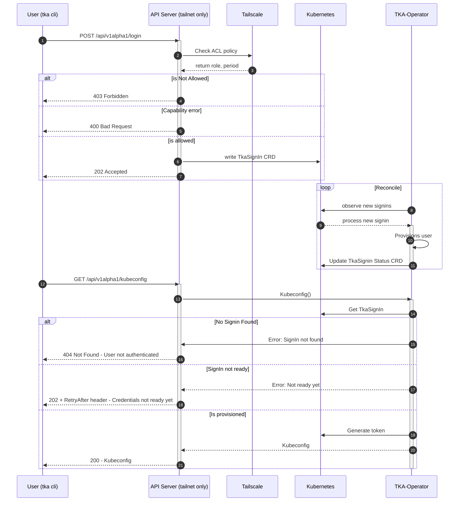
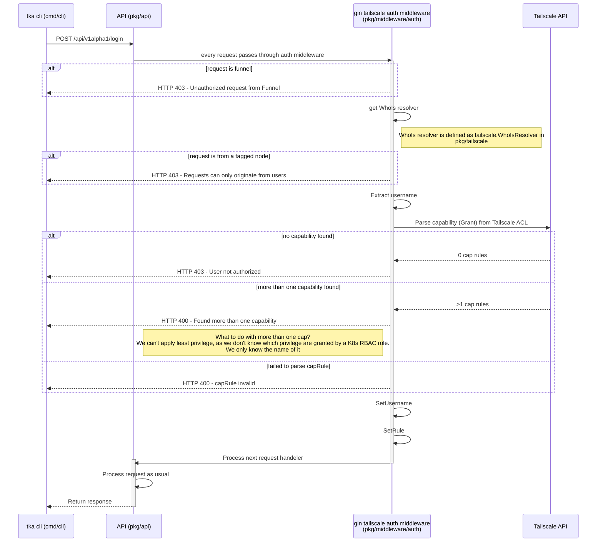
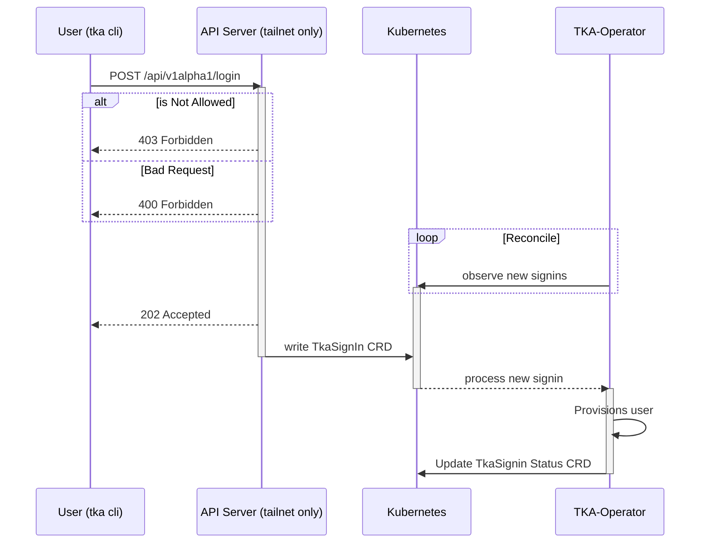
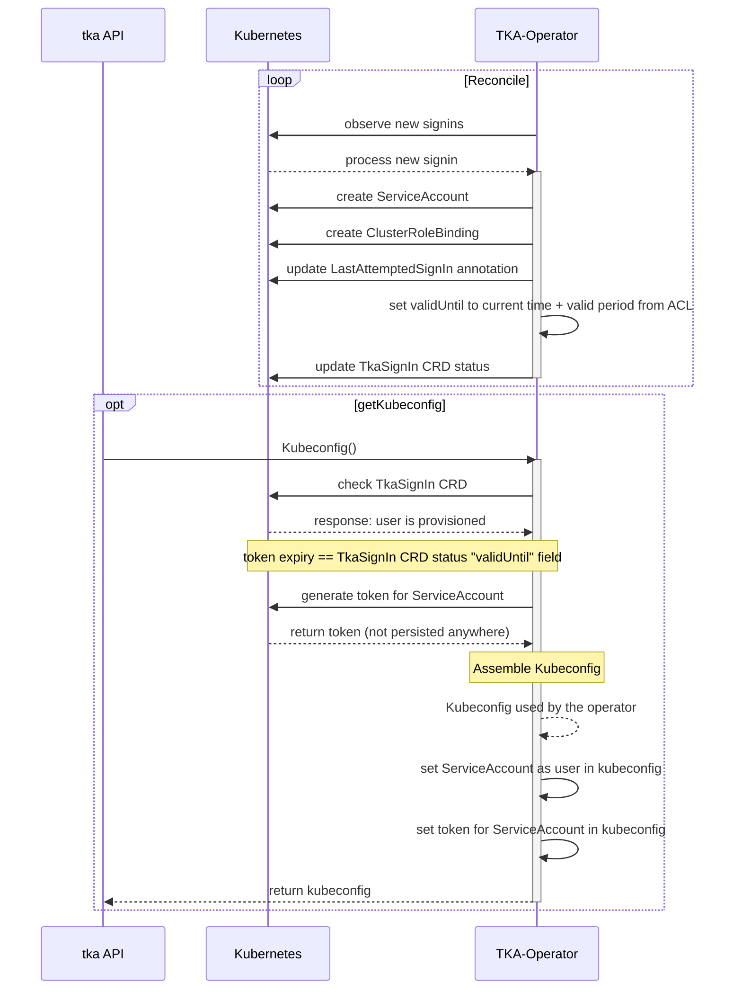
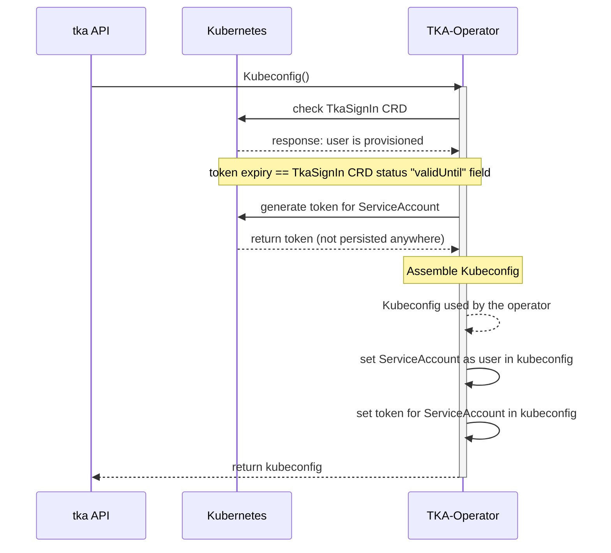

This page is here to provide more in-depth information of the request flows

## Details

### Tailscale Auth Middleware

### SignIn Request

### Provision SignIn

## Request-Flow Get Kubeconfig

