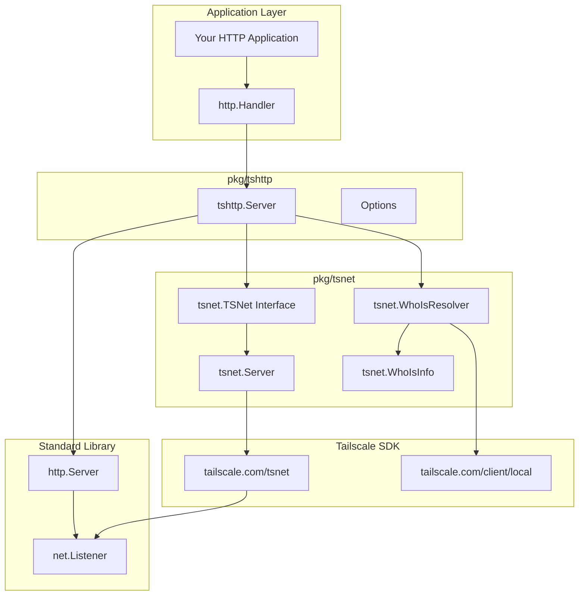

TKA uses two packages for Tailscale networking:

- **`pkg/tshttp`**: High-level HTTP server that runs on Tailscale network
- **`pkg/tsnet`**: Low-level Tailscale networking abstractions and interfaces

Together, these packages provide a Tailscale-network-only HTTP server that is a true drop-in replacement for Go's standard `http.Server`, with automatic security, TLS certificates, and identity resolution.

## Architecture



## pkg/tsnet

The `pkg/tsnet` package provides low-level abstractions for Tailscale networking.

### Key Types

#### TSNet Interface

Abstracts the Tailscale server functionality for testability:

```go
type TSNet interface {
    Up(ctx context.Context) (*ipnstate.Status, error)
    Listen(network, addr string) (net.Listener, error)
    ListenTLS(network, addr string) (net.Listener, error)
    ListenFunnel(network, addr string) (net.Listener, error)
    LocalWhoIs() (WhoIsResolver, error)
    SetDir(dir string)
    SetLogf(logf func(string, ...any))
    Hostname() string
    GetPeerState() *ipnstate.PeerStatus
    IsConnected() bool
    BackendState() BackendState
}
```

#### WhoIsResolver Interface

Interface for identity resolution:

```go
type WhoIsResolver interface {
    WhoIs(ctx context.Context, remoteAddr string) (*WhoIsInfo, humane.Error)
}
```

#### WhoIsInfo

Identity information extracted from Tailscale WhoIs lookups:

```go
type WhoIsInfo struct {
    LoginName string               // User's login name (e.g., "alice@example.com")
    CapMap    tailcfg.PeerCapMap   // Capability grants from ACL
    Tags      []string             // ACL tags (for service accounts)
}

func (w *WhoIsInfo) IsTagged() bool  // Returns true if device is tagged
```

#### TailscaleCapability Interface

For capability-based authorization:

```go
type TailscaleCapability interface {
    Priority() int
}
```

### Mock Support

The `pkg/tsnet/mock` package provides mock implementations for testing:

- `mock.TSNet` - Mock TSNet interface
- `mock.WhoIsResolver` - Mock WhoIsResolver interface

## pkg/tshttp

The `pkg/tshttp` package provides a high-level HTTP server that runs exclusively on the Tailscale network.

### Features

- **Network Isolation**: HTTP server only accessible via Tailscale network
- **Automatic TLS**: HTTPS certificates handled by Tailscale
- **Identity Resolution**: Built-in user identity and capability checking
- **Funnel Detection**: Ability to detect and reject public Funnel traffic
- **Drop-in Replacement**: True drop-in replacement for `http.Server`

### Server Type

```go
type Server struct {
    *http.Server  // Embedded - IS an http.Server

    // Tailscale components
    ts    tsnet.TSNet         // Abstracted tsnet server
    whois tsnet.WhoIsResolver // Resolver for WhoIs lookups
}
```

### Usage Patterns

#### 1. High-Level Usage (All-in-One)

```go
ts := tsnet.NewServer("myapp")
if _, err := ts.Up(ctx); err != nil {
    log.Fatal(err)
}

server := tshttp.NewServer(ts,
    tshttp.WithPort(443),
    tshttp.WithDebug(true),
)

if err := server.Start(ctx); err != nil {
    log.Fatal(err)
}

handler := http.HandlerFunc(func(w http.ResponseWriter, r *http.Request) {
    info, err := server.WhoIs(r.Context(), r.RemoteAddr)
    if err != nil {
        http.Error(w, "Authentication failed", http.StatusUnauthorized)
        return
    }
    fmt.Fprintf(w, "Hello, %s!", info.LoginName)
})

if err := server.Serve(ctx, handler, "tcp"); err != nil {
    log.Fatal(err)
}
```

#### 2. Low-Level Usage (Maximum Control)

```go
ts := tsnet.NewServer("myapp")
if _, err := ts.Up(ctx); err != nil {
    log.Fatal(err)
}

server := tshttp.NewServer(ts)
if err := server.Start(ctx); err != nil {
    log.Fatal(err)
}

listener, err := server.ListenTCP(":8080")
if err != nil {
    log.Fatal(err)
}

// Use any http.Server
httpServer := &http.Server{
    Handler:     myHandler,
    ReadTimeout: 30 * time.Second,
}
go httpServer.Serve(listener)

// Graceful shutdown
shutdownCtx, cancel := context.WithTimeout(context.Background(), 5*time.Second)
defer cancel()
httpServer.Shutdown(shutdownCtx)
server.Stop(shutdownCtx)
```

### Configuration Options

| Option | Description |
| :--- | :--- |
| `WithPort(port int)` | Sets the listening port (default: 443) |
| `WithDebug(bool)` | Enables debug logging |
| `WithStateDir(dir string)` | Sets Tailscale state directory |
| `WithReadTimeout(duration)` | Sets HTTP read timeout |
| `WithReadHeaderTimeout(duration)` | Sets HTTP header read timeout |
| `WithWriteTimeout(duration)` | Sets HTTP write timeout |
| `WithIdleTimeout(duration)` | Sets HTTP idle timeout |

### Server Methods

| Method | Description |
| :--- | :--- |
| `Start(ctx)` | Connects to Tailscale network |
| `ListenTCP(addr)` | Creates TCP listener on tailnet |
| `ListenTLS(addr)` | Creates TLS listener on tailnet |
| `ListenFunnel(addr)` | Creates Funnel listener (public) |
| `Serve(ctx, handler, network)` | High-level serve method |
| `Stop(ctx)` | Gracefully stops the server |
| `WhoIs(ctx, remoteAddr)` | Resolves identity for address |

### Utility Functions

#### IsFunnelRequest

Detects if a request is coming through Tailscale Funnel:

```go
func IsFunnelRequest(r *http.Request) bool
```

**Example:**

```go
func authMiddleware(next http.Handler) http.Handler {
    return http.HandlerFunc(func(w http.ResponseWriter, r *http.Request) {
        if tsnet.IsFunnelRequest(r) {
            http.Error(w, "Access denied: Funnel requests not allowed", http.StatusForbidden)
            return
        }
        next.ServeHTTP(w, r)
    })
}
```

## Security Considerations

- **Tailnet Only**: Server is never exposed to internet directly, only via your tailnet
- **Device Authentication**: All clients must be authenticated members of your tailnet
- **Network ACLs**: Tailscale ACLs control which devices can reach the server
- **Public Traffic**: Server can receive unauthenticated traffic through [Tailscale Funnel](https://tailscale.com/kb/1223/funnel)
  - Use `IsFunnelRequest()` to detect and reject Funnel traffic for sensitive operations

## Dependencies

- [tailscale.com/tsnet](https://pkg.go.dev/tailscale.com/tsnet) - Embedded Tailscale networking
- [tailscale.com/client/local](https://pkg.go.dev/tailscale.com/client/local) - Local Tailscale client for WhoIs
- [tailscale.com/ipn/ipnstate](https://pkg.go.dev/tailscale.com/ipn/ipnstate) - Status and state management

## Related Documentation

- [TKA Architecture](../../understanding/architecture.md) - How this fits into TKA
- [Security Model](../../understanding/security.md) - Security implications
- [Production Deployment](../../getting-started/comprehensive.md#production-deployment) - Production usage patterns
