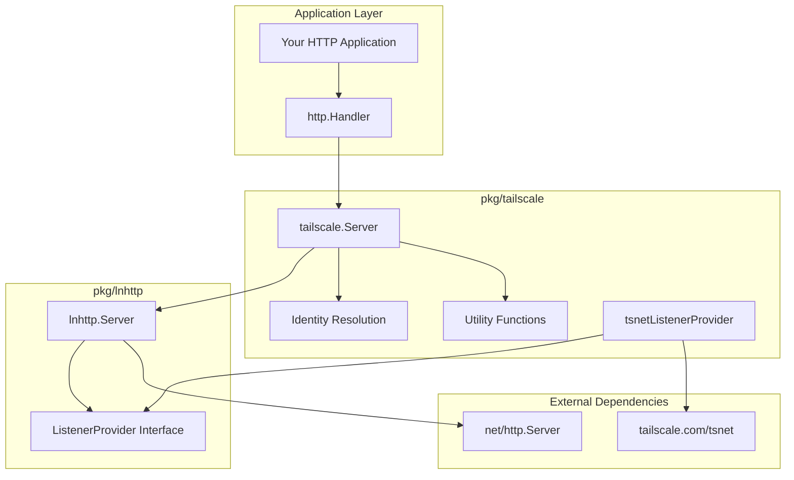

The `pkg/tailscale` package provides a Tailscale-network-only HTTP server by combining [`pkg/lnhttp`](./lnhttp-server.md) with Tailscale's `tsnet` as the listener provider. This creates HTTP servers that are only accessible via the Tailscale network (tailnet), providing automatic security and identity resolution.

**Go Documentation**: [pkg.go.dev/github.com/spechtlabs/tka/pkg/tailscale](https://pkg.go.dev/github.com/spechtlabs/tka/pkg/tailscale)

## Overview

This package builds on `pkg/lnhttp` to provide:

- **Network Isolation**: HTTP server only accessible via Tailscale network
- **Automatic TLS**: HTTPS certificates handled by Tailscale
- **Identity Resolution**: Built-in user identity and capability checking
- **Funnel Detection**: Ability to detect and reject public Funnel traffic
- **Standard Interface**: Drop-in replacement for `http.Server`

## Dependency Chain



**Key Relationships:**

1. `tailscale.Server` **embeds** `lnhttp.Server`
2. `lnhttp.Server` **abstracts** listener creation via `ListenerProvider`
3. `tailscale.Server` **provides** a `tsnet` implementation of `ListenerProvider`
4. `lnhttp.Server` **manages** the standard `http.Server` lifecycle

## How It Works

### Listener Provider Pattern

The `tailscale.Server` implements the listener provider pattern established by `pkg/lnhttp`:

1. **Standard HTTP**: `net.Listen("tcp", ":8080")` → `http.Server.Serve(listener)`
2. **lnhttp**: `provider.Listen(ctx, "tcp", ":8080")` → `http.Server.Serve(listener)`
3. **tailscale**: `tsnet.Server.Listen("tcp", ":8080")` → `http.Server.Serve(listener)`

This abstraction allows the HTTP server logic to remain unchanged while swapping the underlying network implementation.

### Implementation Details

```go
// Internal tsnet provider implementation
type tsnetListenerProvider struct {
    ts *tsnet.Server
}

func (p *tsnetListenerProvider) Listen(ctx context.Context, network, address string) (net.Listener, error) {
    return p.ts.Listen(network, address)
}

// tailscale.Server composition
type Server struct {
    *lnhttp.Server  // Embedded lnhttp server handles HTTP lifecycle

    // Tailscale-specific components
    ts        *tsnet.Server
    lc        *local.Client
    st        *ipnstate.Status
    serverURL string
}
```

When you call `tailscale.Server.Serve()`:

1. `tailscale.Server` connects to the Tailscale network
2. Calls `lnhttp.Server.Serve()` with the tsnet provider
3. `lnhttp.Server` calls `tsnetProvider.Listen()` to get a tailnet listener
4. Standard `http.Server.Serve()` handles HTTP requests over that listener

## Core Types

### Server

The main server type that embeds `lnhttp.Server` and adds Tailscale functionality:

```go
type Server struct {
    *lnhttp.Server
}
```

### WhoIsInfo

Identity information extracted from Tailscale WhoIs lookups:

```go
type WhoIsInfo struct {
    LoginName string               // User's login name (e.g., "alice@example.com")
    CapMap    tailcfg.PeerCapMap   // Capability grants from ACL
    IsTagged  bool                 // Whether the source is a tagged device
}
```

### WhoIsFunc

Function signature for identity resolution:

```go
type WhoIsFunc func(ctx context.Context, remoteAddr string) (*WhoIsInfo, error)
```

## API Reference

### Constructor

#### NewServer

```go
func NewServer(hostname string, opts ...Option) *Server
```

Creates a new Tailscale HTTP server with the specified hostname.

**Parameters:**

- `hostname`: The hostname for this server on the tailnet (e.g., "tka")
- `opts`: Configuration options

**Returns:** A configured `*Server` ready to serve HTTP traffic

**Example:**

```go
server := tailscale.NewServer("myapp",
    tailscale.WithPort(443),
    tailscale.WithDebug(true),
    tailscale.WithStateDir("/var/lib/myapp/ts-state"),
)
```

### Configuration Options

#### WithPort

```go
func WithPort(port int) Option
```

Sets the listening port. Default is 443 (HTTPS).

**Example:**

```go
server := tailscale.NewServer("myapp", tailscale.WithPort(8080))
```

#### WithDebug

```go
func WithDebug(debug bool) Option
```

Enables debug logging for Tailscale operations.

**Example:**

```go
server := tailscale.NewServer("myapp", tailscale.WithDebug(true))
```

#### WithStateDir

```go
func WithStateDir(dir string) Option
```

Sets the directory for Tailscale state storage. If empty, uses automatic directory selection.

**Example:**

```go
server := tailscale.NewServer("myapp",
    tailscale.WithStateDir("/var/lib/myapp/tailscale"))
```

#### HTTP Timeout Options

Configure standard HTTP server timeouts:

```go
func WithReadTimeout(timeout time.Duration) Option
func WithReadHeaderTimeout(timeout time.Duration) Option
func WithWriteTimeout(timeout time.Duration) Option
func WithIdleTimeout(timeout time.Duration) Option
```

**Example:**

```go
server := tailscale.NewServer("myapp",
    tailscale.WithReadTimeout(30*time.Second),
    tailscale.WithWriteTimeout(60*time.Second),
)
```

### Server Methods

#### Serve

```go
func (s *Server) Serve(ctx context.Context, handler http.Handler) humane.Error
```

Starts the server with the provided HTTP handler. This is the preferred method for new code.

**Parameters:**

- `ctx`: Context for server lifecycle
- `handler`: HTTP handler to serve requests

**Returns:** `humane.Error` if startup or serving fails

**Example:**

```go
ctx := context.Background()
handler := http.HandlerFunc(func(w http.ResponseWriter, r *http.Request) {
    fmt.Fprintf(w, "Hello from tailnet!")
})

if err := server.Serve(ctx, handler); err != nil {
    log.Fatal("Server failed:", err)
}
```

#### ListenAndServe

```go
func (s *Server) ListenAndServe() error
```

Standard library compatible method. Uses `s.Handler` and background context.

**Example:**

```go
server.Handler = myHandler
if err := server.ListenAndServe(); err != nil {
    log.Fatal("Server failed:", err)
}
```

#### Shutdown

```go
func (s *Server) Shutdown(ctx context.Context) humane.Error
```

Gracefully shuts down the server.

**Example:**

```go
shutdownCtx, cancel := context.WithTimeout(context.Background(), 30*time.Second)
defer cancel()

if err := server.Shutdown(shutdownCtx); err != nil {
    log.Printf("Shutdown error: %v", err)
}
```

#### Identity

```go
func (s *Server) Identity() WhoIsFunc
```

Returns a function for resolving client identity information.

**Example:**

```go
whoIs := server.Identity()
info, err := whoIs(ctx, request.RemoteAddr)
if err != nil {
    // Handle error
}
fmt.Printf("User: %s, Tagged: %v", info.LoginName, info.IsTagged)
```

#### WhoIs

```go
func (s *Server) WhoIs(ctx context.Context, remoteAddr string) (*WhoIsInfo, error)
```

Directly resolves identity for a remote address.

**Example:**

```go
info, err := server.WhoIs(ctx, "100.64.1.2:12345")
if err != nil {
    return fmt.Errorf("identity lookup failed: %w", err)
}

// Check capabilities
if caps, ok := info.CapMap["example.com/cap/admin"]; ok {
    // User has admin capabilities
}
```

### Utility Functions

#### IsFunnelRequest

```go
func IsFunnelRequest(r *http.Request) bool
```

Detects if an HTTP request is coming through Tailscale Funnel (public internet).

**Parameters:**

- `r`: HTTP request to check

**Returns:** `true` if request is from Funnel, `false` if from tailnet

**Example:**

```go
func authMiddleware(next http.Handler) http.Handler {
    return http.HandlerFunc(func(w http.ResponseWriter, r *http.Request) {
        if tailscale.IsFunnelRequest(r) {
            http.Error(w, "Access denied: Funnel requests not allowed",
                       http.StatusForbidden)
            return
        }
        next.ServeHTTP(w, r)
    })
}
```

#### CtxConnKey

```go
type CtxConnKey struct{}
```

Context key for retrieving the underlying `net.Conn` from request context.

**Example:**

```go
func connectionInfo(r *http.Request) {
    if conn := r.Context().Value(tailscale.CtxConnKey{}); conn != nil {
        if netConn, ok := conn.(net.Conn); ok {
            fmt.Printf("Remote addr: %s", netConn.RemoteAddr())
        }
    }
}
```

## Usage Patterns

### Basic HTTP Server

```go
package main

import (
    "context"
    "fmt"
    "net/http"

    "github.com/spechtlabs/tka/pkg/tailscale"
)

func main() {
    // Create server
    server := tailscale.NewServer("myapp",
        tailscale.WithPort(443),
        tailscale.WithDebug(true),
    )

    // Simple handler
    handler := http.HandlerFunc(func(w http.ResponseWriter, r *http.Request) {
        fmt.Fprintf(w, "Hello from %s!", r.Host)
    })

    // Start server
    ctx := context.Background()
    if err := server.Serve(ctx, handler); err != nil {
        panic(err)
    }
}
```

### Authentication Middleware

```go
func authMiddleware(server *tailscale.Server) func(http.Handler) http.Handler {
    return func(next http.Handler) http.Handler {
        return http.HandlerFunc(func(w http.ResponseWriter, r *http.Request) {
            // Reject Funnel requests
            if tailscale.IsFunnelRequest(r) {
                http.Error(w, "Access denied", http.StatusForbidden)
                return
            }

            // Get user identity
            info, err := server.WhoIs(r.Context(), r.RemoteAddr)
            if err != nil {
                http.Error(w, "Authentication failed", http.StatusUnauthorized)
                return
            }

            // Check for required capability
            if _, ok := info.CapMap["example.com/cap/api-access"]; !ok {
                http.Error(w, "Insufficient permissions", http.StatusForbidden)
                return
            }

            // Add user info to context
            ctx := context.WithValue(r.Context(), "user", info.LoginName)
            next.ServeHTTP(w, r.WithContext(ctx))
        })
    }
}
```

### Production Server

```go
func createProductionServer() *tailscale.Server {
    return tailscale.NewServer("api-server",
        // Production timeouts
        tailscale.WithReadTimeout(30*time.Second),
        tailscale.WithReadHeaderTimeout(10*time.Second),
        tailscale.WithWriteTimeout(60*time.Second),
        tailscale.WithIdleTimeout(300*time.Second),

        // State directory
        tailscale.WithStateDir("/var/lib/myapp/ts-state"),

        // Standard HTTPS port
        tailscale.WithPort(443),

        // Disable debug in production
        tailscale.WithDebug(false),
    )
}
```

### Graceful Shutdown

```go
func runServerWithGracefulShutdown() {
    server := tailscale.NewServer("myapp")

    // Start server in goroutine
    serverCtx, serverCancel := context.WithCancel(context.Background())
    defer serverCancel()

    go func() {
        if err := server.Serve(serverCtx, myHandler); err != nil {
            log.Printf("Server error: %v", err)
        }
    }()

    // Wait for interrupt signal
    sigCh := make(chan os.Signal, 1)
    signal.Notify(sigCh, os.Interrupt, syscall.SIGTERM)
    <-sigCh

    // Graceful shutdown
    log.Println("Shutting down server...")
    shutdownCtx, cancel := context.WithTimeout(context.Background(), 30*time.Second)
    defer cancel()

    if err := server.Shutdown(shutdownCtx); err != nil {
        log.Printf("Shutdown error: %v", err)
    }
}
```

## Security Considerations

### Network Isolation

- **Tailnet Only**: Server is never exposed to public internet
- **Device Authentication**: All clients must be authenticated Tailscale devices
- **Network ACLs**: Tailscale ACLs control which devices can reach the server

### Funnel Protection

- **Automatic Detection**: `IsFunnelRequest()` identifies public traffic
- **Explicit Rejection**: Applications should reject Funnel requests for sensitive operations
- **Connection Context**: Raw network connection available for custom checks

### Identity Verification

- **Real-time Resolution**: `WhoIs` provides up-to-date identity information
- **Capability Checking**: ACL grants can be verified for fine-grained authorization
- **Tagged Device Detection**: Can distinguish between user and service accounts

## Integration with TKA

In TKA, the tailscale package is used to:

1. **Expose the API server** only within the tailnet
2. **Authenticate users** via WhoIs lookups
3. **Validate capabilities** from Tailscale ACL grants
4. **Reject Funnel traffic** to prevent public access
5. **Generate audit logs** with user identity information

**Example from TKA:**

```go
// Create TKA server with tailscale networking
tsServer := tailscale.NewServer(hostname,
    tailscale.WithPort(port),
    tailscale.WithStateDir(stateDir),
    tailscale.WithDebug(debug),
)

// Set up authentication middleware
authMiddleware := auth.NewTailscaleMiddleware(tsServer.Identity(), capabilityName)

// Start server with Gin router
router := gin.New()
router.Use(authMiddleware.GinMiddleware())
// ... add routes ...

if err := tsServer.Serve(ctx, router); err != nil {
    return fmt.Errorf("failed to start server: %w", err)
}
```

## Testing

The package includes comprehensive tests demonstrating:

- Server initialization with various options
- Connection context storage and retrieval
- Identity function availability
- Graceful shutdown behavior

**Example test:**

```go
func TestServer_Identity(t *testing.T) {
    server := tailscale.NewServer("test-host",
        tailscale.WithPort(8080),
        tailscale.WithDebug(true),
    )

    // Verify identity function is available
    whoIs := server.Identity()
    require.NotNil(t, whoIs)

    // Verify connection context is set up
    require.NotNil(t, server.ConnContext)
}
```

## Dependencies

- **tailscale.com/tsnet**: Embedded Tailscale networking
- **tailscale.com/client/local**: Local Tailscale client for WhoIs
- **tailscale.com/ipn/ipnstate**: Status and state management
- **github.com/spechtlabs/tka/pkg/lnhttp**: Listener abstraction layer

## Related Documentation

- [pkg/lnhttp](./lnhttp-server.md) - Understanding the listener abstraction that this package builds on
- [TKA Architecture](../../explanation/architecture.md) - How this fits into TKA
- [Security Model](../../explanation/security.md) - Security implications
- [Production Deployment](../../how-to/deploy-production.md) - Production usage patterns
