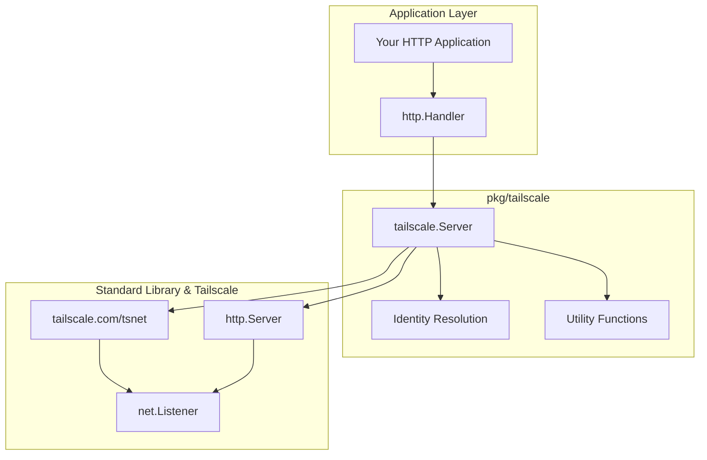

The `pkg/tailscale` package provides a Tailscale-network-only HTTP server that is a true drop-in replacement for Go's standard `http.Server`. This creates HTTP servers that are only accessible via the Tailscale network (tailnet), providing automatic security, TLS certificates, and identity resolution.

**Go Documentation**: [pkg.go.dev/github.com/spechtlabs/tka/pkg/tailscale](https://pkg.go.dev/github.com/spechtlabs/tka/pkg/tailscale)

## Overview

This package provides a clean, modern interface for Tailscale HTTP servers with multiple usage patterns:

- **Network Isolation**: HTTP server only accessible via Tailscale network
- **Automatic TLS**: HTTPS certificates handled by Tailscale
- **Identity Resolution**: Built-in user identity and capability checking
- **Funnel Detection**: Ability to detect and reject public Funnel traffic
- **Drop-in Replacement**: True drop-in replacement for `http.Server`
- **Flexible Interface**: Multiple usage patterns from simple to advanced

## Architecture



**Key Design:**

1. `tailscale.Server` **embeds** `http.Server` directly - it IS an `http.Server`
2. `tailscale.Server` **connects** to Tailscale network via `tsnet`
3. `tailscale.Server` **provides** standard `net.Listener` instances from Tailscale
4. **No abstraction layers** - direct integration with standard Go HTTP patterns

## Usage Patterns

The package supports two usage patterns to match different complexity needs:

### 1. High-Level Usage (All-in-One)

Use the `Serve()` method for a complete solution:

```go
server := tailscale.NewServer("myapp",
    tailscale.WithPort(443),
    tailscale.WithDebug(true),
)

handler := http.HandlerFunc(func(w http.ResponseWriter, r *http.Request) {
    info, err := server.WhoIs(r.Context(), r.RemoteAddr)
    if err != nil {
        http.Error(w, "Authentication failed", http.StatusUnauthorized)
        return
    }
    fmt.Fprintf(w, "Hello, %s!", info.LoginName)
})

if err := server.Serve(ctx, handler); err != nil {
    log.Fatal(err)
}
```

> [!TIP]
> See the [Example: High-Level Usage (All-in-One)](#example-high-level-usage-all-in-one) for more info

### 2. Low-Level Usage (Maximum Control)

Use `Start()` + `ListenTCP()` with standard `http.Server` for maximum control:

```go
server := tailscale.NewServer("myapp")
if err := server.Start(ctx); err != nil {
    log.Fatal(err)
}

listener, err := server.ListenTCP(":8080")
if err != nil {
    log.Fatal(err)
}

// Use any http.Server - server is just for connection setup
httpServer := &http.Server{
    Handler: myHandler,
    ReadTimeout: 30 * time.Second,
}
go func() {
    if err := httpServer.Serve(listener); !errors.Is(err, http.ErrServerClosed) {
        log.Printf("HTTP server error: %v", err)
    }
}()

// Graceful shutdown
shutdownCtx, cancel := context.WithTimeout(context.Background(), 5*time.Second)
defer cancel()
if err := httpServer.Shutdown(shutdownCtx); err != nil {
    log.Printf("HTTP shutdown error: %v", err)
}
if err := server.Stop(shutdownCtx); err != nil {
    log.Printf("Tailscale shutdown error: %v", err)
}
```

> [!TIP]
> See the [Example: Low-Level Usage (Maximum Control)](#example-high-level-usage-all-in-one) for more info

## Core Types

### Server

The main server type that embeds `http.Server` and adds Tailscale functionality:

```go
type Server struct {
    *http.Server  // Embedded - IS an http.Server

    // Configuration
    debug    bool
    port     int
    hostname string

    // Tailscale components
    ts        *tsnet.Server
    lc        *local.Client
    st        *ipnstate.Status
    serverURL string
    started   bool
}
```

### WhoIsInfo

Identity information extracted from Tailscale WhoIs lookups:

```go
type WhoIsInfo struct {
    LoginName string               // User's login name (e.g., "alice@example.com")
    CapMap    tailcfg.PeerCapMap   // Capability grants from ACL
    IsTagged  bool                 // Whether the source is a tagged device
}
```

### WhoIsResolver

Interface for identity resolution:

```go
type WhoIsResolver interface {
    WhoIs(ctx context.Context, remoteAddr string) (*WhoIsInfo, humane.Error)
}
```

This interface is implemented by the `tailscale.Server` and can be mocked for testing with the `pkg/tailscale/mock` package.

## API Reference

### Constructor

#### NewServer

```go
func NewServer(hostname string, opts ...Option) *Server
```

Creates a new Tailscale HTTP server with the specified hostname.

**Parameters:**

- `hostname`: The hostname for this server on the tailnet (e.g., "tka")
- `opts`: Configuration options

**Returns:** A configured `*Server` ready to serve HTTP traffic

**Example:**

```go
server := tailscale.NewServer("myapp",
    tailscale.WithPort(443),
    tailscale.WithDebug(true),
    tailscale.WithStateDir("/var/lib/myapp/ts-state"),
)
```

### Configuration Options

#### WithPort

```go
func WithPort(port int) Option
```

Sets the listening port. Default is 443 (HTTPS).

#### WithDebug

```go
func WithDebug(debug bool) Option
```

Enables debug logging for Tailscale operations.

#### WithStateDir

```go
func WithStateDir(dir string) Option
```

Sets the directory for Tailscale state storage. If empty, uses automatic directory selection.

#### HTTP Timeout Options

Configure standard HTTP server timeouts:

```go
func WithReadTimeout(timeout time.Duration) Option
func WithReadHeaderTimeout(timeout time.Duration) Option
func WithWriteTimeout(timeout time.Duration) Option
func WithIdleTimeout(timeout time.Duration) Option
```

### Server Methods

#### Start

```go
func (s *Server) Start(ctx context.Context) humane.Error
```

Connects to the Tailscale network and prepares the server for accepting connections. This method separates connection setup from serving.

**Example:**

```go
server := tailscale.NewServer("myapp")
if err := server.Start(ctx); err != nil {
    log.Fatal(err.Display())
}
```

#### ListenTCP

```go
func (s *Server) ListenTCP(address string) (net.Listener, humane.Error)
```

Creates a TCP listener on the Tailscale network. Returns a standard `net.Listener` that can be used with any `http.Server`.

**Note:** The server must be started with `Start()` before calling this method.

**Example:**

```go
listener, err := server.ListenTCP(":8080")
if err != nil {
    log.Fatal(err.Display())
}

httpServer := &http.Server{
    Handler: myHandler,
    ReadTimeout: 30 * time.Second,
}
go httpServer.Serve(listener)
```

#### Stop

```go
func (s *Server) Stop(ctx context.Context) humane.Error
```

Gracefully stops the Tailscale server.

**Example:**

```go
if err := server.Stop(ctx); err != nil {
    log.Printf("Stop error: %v", err)
}
```

#### Serve

```go
func (s *Server) Serve(ctx context.Context, handler http.Handler) humane.Error
```

Starts the server with the provided HTTP handler. This is the high-level method that handles everything automatically.

**Parameters:**

- `ctx`: Context for server lifecycle
- `handler`: HTTP handler to serve requests

**Returns:** `humane.Error` if startup or serving fails

**Example:**

```go
ctx := context.Background()
handler := http.HandlerFunc(func(w http.ResponseWriter, r *http.Request) {
    fmt.Fprintf(w, "Hello from tailnet!")
})

if err := server.Serve(ctx, handler); err != nil {
    log.Fatal("Server failed:", err.Display())
}
```

#### ListenAndServe

```go
func (s *Server) ListenAndServe() error
```

Standard library compatible method. Uses `s.Handler` and background context.

**Example:**

```go
server.Handler = myHandler
if err := server.ListenAndServe(); err != nil {
    log.Fatal("Server failed:", err)
}
```

#### Shutdown

```go
func (s *Server) Shutdown(ctx context.Context) humane.Error
```

Gracefully shuts down the server.

**Example:**

```go
shutdownCtx, cancel := context.WithTimeout(context.Background(), 30*time.Second)
defer cancel()

if err := server.Shutdown(shutdownCtx); err != nil {
    log.Printf("Shutdown error: %v", err)
}
```

#### WhoIs

```go
func (s *Server) WhoIs(ctx context.Context, remoteAddr string) (*WhoIsInfo, error)
```

Directly resolves identity for a remote address.

**Example:**

```go
info, err := server.WhoIs(ctx, "100.64.1.2:12345")
if err != nil {
    return fmt.Errorf("identity lookup failed: %w", err)
}

// Check capabilities
if caps, ok := info.CapMap["example.com/cap/admin"]; ok {
    // User has admin capabilities
}
```

### Utility Functions

#### IsFunnelRequest

```go
func IsFunnelRequest(r *http.Request) bool
```

Detects if an HTTP request is coming through Tailscale Funnel (public internet).

**Example:**

```go
func authMiddleware(next http.Handler) http.Handler {
    return http.HandlerFunc(func(w http.ResponseWriter, r *http.Request) {
        if tailscale.IsFunnelRequest(r) {
            http.Error(w, "Access denied: Funnel requests not allowed", http.StatusForbidden)
            return
        }
        next.ServeHTTP(w, r)
    })
}
```

> [!TIP]
> See the [Example: Authentication Middleware](#example-authentication-middleware) for more info

#### CtxConnKey

```go
type CtxConnKey struct{}
```

Context key for retrieving the underlying `net.Conn` from request context.

## Examples

### Example: High-Level Usage (All-in-One)

```go
package main

import (
    "context"
    "fmt"
    "net/http"

    "github.com/spechtlabs/tka/pkg/tailscale"
)

func main() {
    // Create server
    server := tailscale.NewServer("myapp",
        tailscale.WithPort(443),
        tailscale.WithDebug(true),
    )

    // Simple handler
    handler := http.HandlerFunc(func(w http.ResponseWriter, r *http.Request) {
        fmt.Fprintf(w, "Hello from %s!", r.Host)
    })

    // Start server
    ctx := context.Background()
    if err := server.Serve(ctx, handler); err != nil {
        panic(err.Display())
    }
}
```

### Example: Low-Level Usage (Maximum Control)

```go
package main

import (
    "context"
    "errors"
    "log"
    "net/http"
    "os"
    "os/signal"
    "syscall"
    "time"

    "github.com/spechtlabs/tka/pkg/tailscale"
)

func main() {
    // Create server
    server := tailscale.NewServer("myapp")

    // Start with timeout
    ctx, cancel := context.WithTimeout(context.Background(), 30*time.Second)
    defer cancel()
    if err := server.Start(ctx); err != nil {
        log.Fatal(err.Display())
    }

    // Create HTTP server
    mux := http.NewServeMux()
    mux.HandleFunc("/", func(w http.ResponseWriter, r *http.Request) {
        info, err := server.WhoIs(r.Context(), r.RemoteAddr)
        if err != nil {
            http.Error(w, "Authentication failed", http.StatusUnauthorized)
            return
        }
        fmt.Printf("Request from %s: %s %s\n", info.LoginName, r.Method, r.URL.Path)
        fmt.Fprintf(w, "Hello %s from Tailscale!", info.LoginName)
    })

    // Listen on Tailscale network
    listener, err := server.ListenTCP(":8080")
    if err != nil {
        log.Fatal(err.Display())
    }

    // Standard HTTP server
    httpServer := &http.Server{Handler: mux}
    go func() {
        if err := httpServer.Serve(listener); !errors.Is(err, http.ErrServerClosed) {
            log.Printf("HTTP server error: %v", err)
        }
    }()

    log.Printf("HTTP server listening on Tailscale network port 8080")

    // Handle shutdown
    stop := make(chan os.Signal, 1)
    signal.Notify(stop, syscall.SIGINT, syscall.SIGTERM)
    <-stop

    shutdownCtx, cancel := context.WithTimeout(context.Background(), 5*time.Second)
    defer cancel()

    if err := httpServer.Shutdown(shutdownCtx); err != nil {
        log.Printf("HTTP shutdown error: %v", err)
    }
    if err := server.Stop(shutdownCtx); err != nil {
        log.Printf("Tailscale shutdown error: %v", err)
    }
}
```

### Example: Authentication Middleware

```go
func authMiddleware(server *tailscale.Server) func(http.Handler) http.Handler {
    return func(next http.Handler) http.Handler {
        return http.HandlerFunc(func(w http.ResponseWriter, r *http.Request) {
            // Reject Funnel requests
            if tailscale.IsFunnelRequest(r) {
                http.Error(w, "Access denied", http.StatusForbidden)
                return
            }

            // Get user identity
            info, err := server.WhoIs(r.Context(), r.RemoteAddr)
            if err != nil {
                http.Error(w, "Authentication failed", http.StatusUnauthorized)
                return
            }

            // Check for required capability
            if _, ok := info.CapMap["example.com/cap/api-access"]; !ok {
                http.Error(w, "Insufficient permissions", http.StatusForbidden)
                return
            }

            // Add user info to context
            ctx := context.WithValue(r.Context(), "user", info.LoginName)
            next.ServeHTTP(w, r.WithContext(ctx))
        })
    }
}
```

> [!TIP]
> To see a Gin-Authentication Middleware in action, check out the [tka source code on GitHub](https://github.com/SpechtLabs/tka/blob/main/pkg/middleware/auth/gin.go)

## Security Considerations

- **Tailnet Only**: Server is never exposed to internet directly, only via your tailnet
- **Device Authentication**: All clients must be authenticated members of your tailnet
- **Network ACLs**: Tailscale ACLs control which devices can reach the server
- **Public Traffic**: Your server can still receive unauthenticated traffic from the public internet through Tailscale [Funnel]
  - Public traffic can easily identified by using the `IsFunnelRequest()` function
  - Applications should reject Funnel requests for sensitive operations

[Funnel]: https://tailscale.com/kb/1223/funnel

## Dependencies

- [tailscale.com/tsnet](https://pkg.go.dev/tailscale.com/tsnet) Embedded Tailscale networking
- [tailscale.com/client/local](https://pkg.go.dev/tailscale.com/client/local) Local Tailscale client for WhoIs
- [tailscale.com/ipn/ipnstate]([tailscale.com/ipn/ipnstate](https://pkg.go.dev/tailscale.com/ipn/ipnstate)) Status and state management
- [github.com/sierrasoftworks/humane-errors-go]([github.com/sierrasoftworks/humane-errors-go](https://github.com/sierrasoftworks/humane-errors-go)) Human-friendly error handling

## Related Documentation

- [TKA Architecture](../../explanation/architecture.md) - How this fits into TKA
- [Security Model](../../explanation/security.md) - Security implications
- [Production Deployment](../../how-to/deploy-production.md) - Production usage patterns
