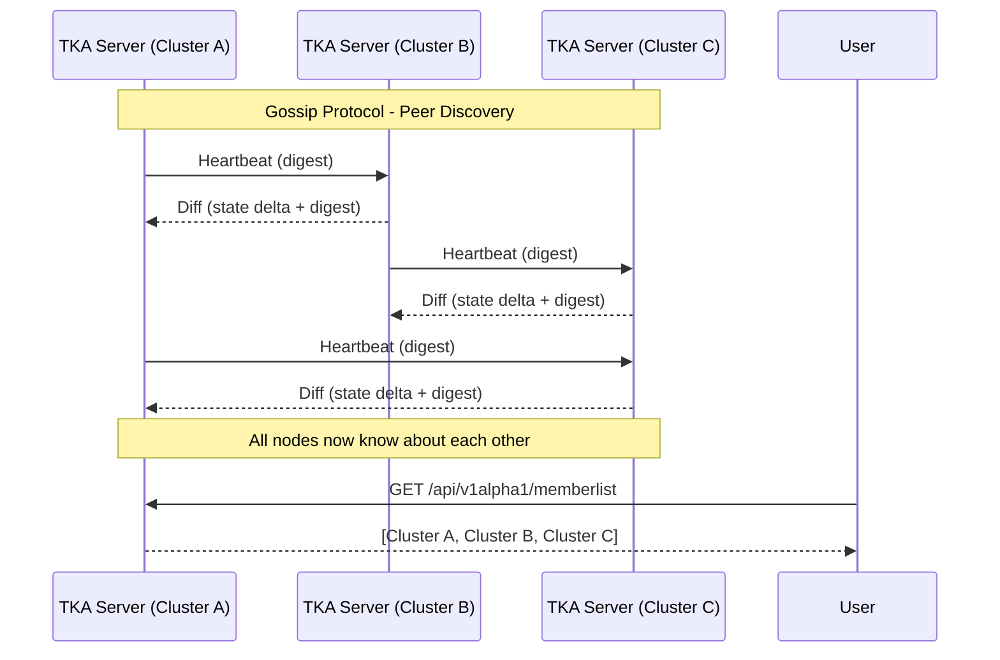

TKA is designed to bridge **Tailscale identity** with **Kubernetes RBAC** using
**ephemeral ServiceAccounts** and **short‑lived tokens**.

This page explains the *why* and *how* of the architecture, so you can
understand the moving parts and their responsibilities.

## The Big Picture

At a high level, TKA has four main components:

<!-- markdownlint-disable MD051 -->
- **[TKA CLI](#tka-cli)** → the user‑facing tool that makes authentication feel seamless
- **[TKA API Server](#tka-api-server)** → the entrypoint for users, running inside your tailnet
- **[TKA Operator](#tka-operator)** → a Kubernetes controller that provisions and cleans up ephemeral credentials
- **[TKA Gossip Layer](#tka-gossip-layer)** → peer-to-peer cluster discovery and metadata synchronization
<!-- markdownlint-enable MD051 -->

Together, they form a loop:

1. A user authenticates via the CLI.
2. The server validates identity and writes a `TkaSignin` resource.
3. The operator reconciles that resource into a ServiceAccount + RBAC binding.
4. The CLI fetches a kubeconfig with a short‑lived token.

### Multi-Cluster Discovery

When multiple TKA servers are deployed, they discover each other using a gossip protocol:

## Why This Design?

- **Ephemeral by default** → credentials expire automatically, reducing risk
- **Network‑gated** → only accessible inside your tailnet, no public ingress
- **Kubernetes‑native** → uses ServiceAccounts and RBAC, no custom auth layer
- **Separation of concerns** → server handles identity, operator handles Kubernetes resources

This separation keeps the server stateless and auditable, while the operator
owns the lifecycle of in‑cluster resources.

## Component Roles

> [!NOTE]
> See [Developer Documentation: Architecture](../reference/developer/architecture.md) for implementation details

### TKA CLI [^dev-cli]

- Provides a simple UX (`tka login`, `tka shell`)
- Talks to the server, manages kubeconfigs
- Makes ephemeral access feel like a normal `kubectl` workflow

### TKA API Server [^dev-api-srv]

- Runs inside the tailnet, exposes an HTTP API
- Authenticates users via Tailscale WhoIs + ACLs
- Writes `TkaSignin` resources into the cluster
- Returns kubeconfigs with ephemeral tokens

### TKA Operator [^dev-k8s-oper]

- Watches for `TkaSignin` resources
- Creates/deletes ServiceAccounts and RoleBindings
- Generates tokens and cleans up expired sessions

### TKA Gossip Layer [^dev-gossip]

- Enables TKA servers to discover each other
- Uses a scuttlebutt anti-entropy gossip protocol
- Shares cluster metadata (API endpoint, port, labels)
- Tracks peer health with failure detection
- Provides eventually consistent cluster membership
- Exposes `/memberlist` API for users to discover available clusters

> [!TIP]
> For a deep dive into how the gossip protocol works, see [Cluster Discovery & Gossip Protocol](./clustering.md).
> For configuration options, see the [Configuration Reference](../reference/configuration.md#cluster-gossip-protocol).

[^dev-cli]: [Developer Architecture Reference | System Components | 1. TKA CLI](../reference/developer/architecture.md#1-tka-cli)
[^dev-api-srv]: [Developer Architecture Reference | System Components | 2. TKA Server](../reference/developer/architecture.md#2-tka-server)
[^dev-k8s-oper]: [Developer Architecture Reference | System Components | 5. TKA Operator (Controller)](../reference/developer/architecture.md#5-tka-operator-controller)
[^dev-gossip]: [Developer Architecture Reference | System Components | 6. Cluster Discovery Layer](../reference/developer/architecture.md#6-cluster-discovery-layer-pkgcluster)

## How It Fits Together

Think of TKA as a bridge:

- On one side: Tailscale provides *who you are* (device + user identity).
- On the other: Kubernetes enforces *what you can do* (RBAC).
- In the middle: TKA glues them together with short‑lived credentials.

## Where to Go Next

- For **implementation details** (API endpoints, CLI commands, config knobs), see the [Developer Reference](../reference/).
- For **security considerations**, see the [Security Model](./security.md).
- For **deployment guidance**, see the [Comprehensive Guide](../getting-started/comprehensive.md) (includes production deployment).
