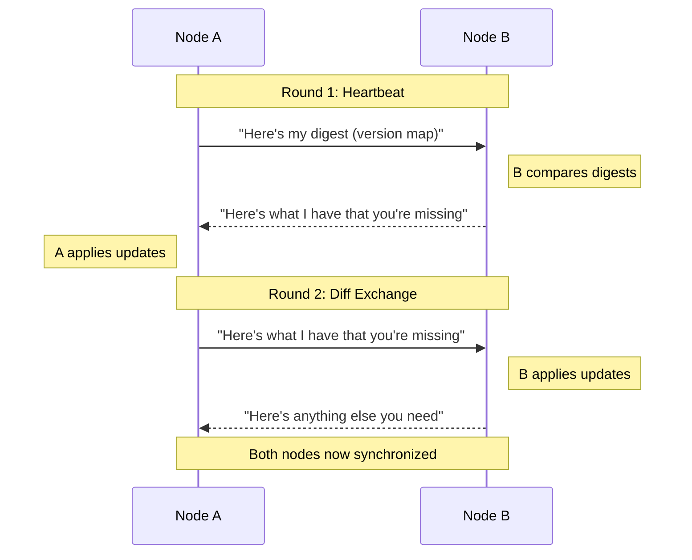
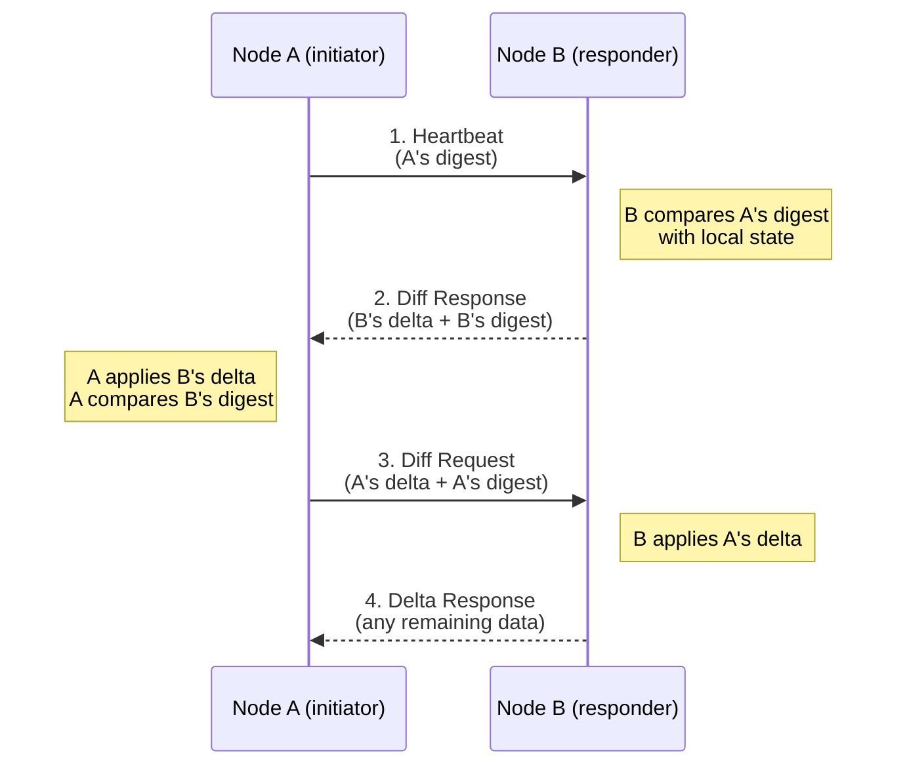
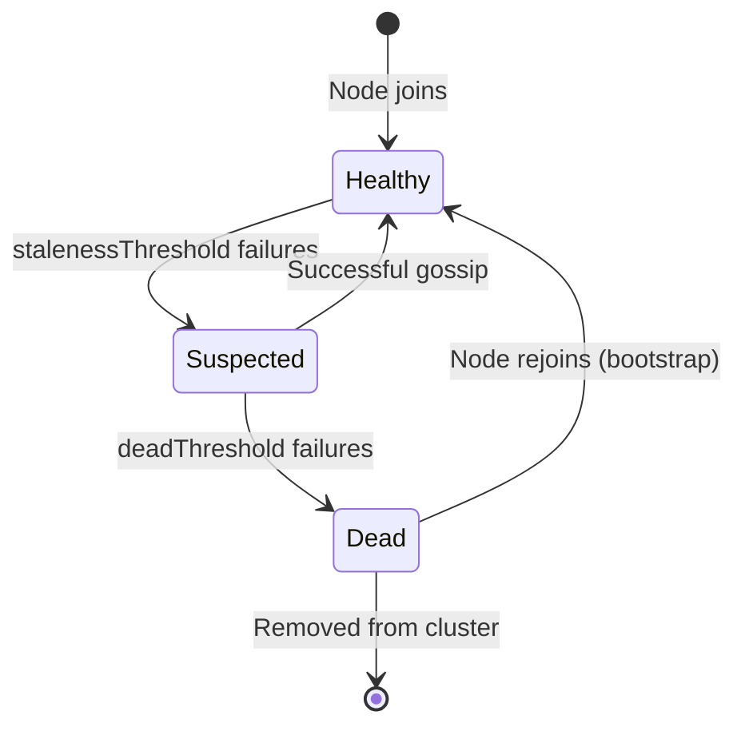

This page explains *how* and *why* TKA uses a gossip protocol for multi-cluster discovery. For setup instructions, see the [Clustering Getting Started Guide](../getting-started/clustering.md).

## The Problem: Multi-Cluster Visibility

Organizations often run multiple Kubernetes clusters across regions, environments, or teams. Users need to:

1. **Discover** which clusters exist
2. **Authenticate** to any cluster they have access to
3. **Switch** between clusters seamlessly

Without clustering, users would need separate configuration for each TKA server. With clustering, users configure **one** TKA server and gain visibility into **all** clusters.

## The Solution: Scuttlebutt Anti-Entropy Gossip

TKA uses a **[scuttlebutt-style anti-entropy gossip protocol]** for cluster discovery. This is the same approach used by systems like Apache Cassandra, Riak, and HashiCorp Serf.

[scuttlebutt-style anti-entropy gossip protocol]: https://dl.acm.org/doi/10.1145/3548606.3560638?__cf_chl_tk=dWtbYbaCvvTozjIIW_0ltas3HKdQ0mpptTZWp2wxNuU-1759226406-1.0.1.1-xDUFNAVe_eZvIW1KQ40f2fjjKGTiPndAbMcbWGS.DN8

### Why Gossip?

| Requirement | How Gossip Helps |
| --- | --- |
| **Decentralized** | No single point of failure or coordination |
| **Scalable** | O(log N) convergence, handles hundreds of nodes |
| **Resilient** | Tolerates network partitions and node failures |
| **Simple** | Nodes only need to know about *some* peers to join |
| **Eventually Consistent** | All nodes converge to the same state |

### How Scuttlebutt Works

Scuttlebutt is named after sailor slang for "rumor" or "gossip." The protocol works by having nodes periodically exchange **digests** (summaries) of their state, then reconciling differences.



#### Key Concepts

1. **Version Vector**: Each node maintains a version number for its state. When state changes, the version increments.

2. **Digest**: A compact summary of known nodes and their versions. Used to detect what information is missing.

3. **Delta**: The actual state data that needs to be synchronized. Only sent when digests differ.

4. **Anti-Entropy**: The process of comparing digests and exchanging deltas to eliminate inconsistencies.

### The Three-Way Handshake

TKA's gossip uses a three-message handshake:



| Message | Purpose |
| --- | --- |
| **Heartbeat** | Initiator sends its digest to check for differences |
| **Diff Response** | Responder sends its updates + its own digest |
| **Diff Request** | Initiator sends its updates based on responder's digest |
| **Delta Response** | Responder sends any remaining updates |

### Failure Detection

The gossip protocol also handles peer failure detection:

| State | Condition | Behavior |
| --- | --- | --- |
| **Healthy** | Recent successful gossip | Normal operation |
| **Suspected** | `stalenessThreshold` consecutive failures | Still contacted, marked suspect |
| **Dead** | `deadThreshold` consecutive failures | Removed from cluster |

When a suspected-dead node responds, it's automatically **resurrected**—no manual intervention needed.



## How TKA Uses Gossip

### What's Shared

Each TKA server shares **NodeMetadata** via gossip:

```go
type NodeMetadata struct {
    APIEndpoint string            // Kubernetes API server URL
    APIPort     int               // TKA API server port
    Labels      map[string]string // Cluster labels
}
```

This metadata is used by:

- **`/memberlist` endpoint**: Returns all known clusters
- **CLI discovery**: Shows users available clusters
- **Future**: Automatic cluster selection based on labels

### Gossip Configuration

| Setting | Default | Purpose |
| --- | --- | --- |
| `gossip.port` | `7946` | TCP port for gossip communication |
| `gossip.factor` | `3` | Number of peers to contact per round |
| `gossip.interval` | `1s` | Time between gossip rounds |
| `gossip.bootstrapPeers` | `[]` | Initial peers to connect to |
| `gossip.stalenessThreshold` | `5` | Rounds before marking peer suspect |
| `gossip.deadThreshold` | `10` | Rounds before removing peer |

### Convergence Time

With default settings, information propagates through the cluster in approximately:

```text
Convergence ≈ log₂(N) × gossip.interval × gossip.factor
```

For a 10-node cluster: `log₂(10) × 1s × 3 ≈ 10 seconds`

In practice, convergence is often faster due to bidirectional communication.

## Architecture Overview

```mermaid
flowchart TB
    subgraph Cluster A
        tka1[TKA Server A]
        k8s1[(Kubernetes A)]
        tka1 --> k8s1
    end

    subgraph Cluster B
        tka2[TKA Server B]
        k8s2[(Kubernetes B)]
        tka2 --> k8s2
    end

    subgraph Cluster C
        tka3[TKA Server C]
        k8s3[(Kubernetes C)]
        tka3 --> k8s3
    end

    tka1 <-->|gossip| tka2
    tka2 <-->|gossip| tka3
    tka1 <-->|gossip| tka3

    subgraph User
        cli[TKA CLI]
        config[config.yaml<br/>default: tka-a]
    end

    cli -->|1. GET /memberlist| tka1
    tka1 -->|2. [A, B, C]| cli
    cli -->|3. POST /login| tka2
    tka2 -->|4. kubeconfig| cli
```

### User Flow

1. **Configure**: User sets a default TKA server in `~/.config/tka/config.yaml`
2. **Discover**: CLI queries `/memberlist` from the default server
3. **Choose**: User sees all available clusters with their labels
4. **Login**: User authenticates to any cluster using `--server` flag

## Protocol Details

### Message Types

TKA uses Protocol Buffers for gossip messages:

| Message | Direction | Content |
| --- | --- | --- |
| `GossipHeartbeatRequest` | Initiator → Responder | Envelope + digest |
| `GossipDiffResponse` | Responder → Initiator | Envelope + delta + digest |
| `GossipDiffRequest` | Initiator → Responder | Envelope + delta + digest |
| `GossipDeltaResponse` | Responder → Initiator | Envelope + delta (if needed) |

### Digest Structure

The digest is a map of node IDs to version information:

```protobuf
message VersionDigest {
    int64 version = 1;      // Current version number
    PeerState peer_state = 2; // HEALTHY, SUSPECTED_DEAD, DEAD
}

// Digest: map<string, VersionDigest>
// Key: node ID (e.g., "tka-prod-us:7946")
```

### Security Considerations

- **Transport**: Gossip runs over the Tailscale network (encrypted, authenticated)
- **Integrity**: Messages include SHA-256 hashes for tamper detection
- **No Secrets**: Only cluster metadata is shared—no credentials or tokens

## Comparison with Alternatives

| Approach | Pros | Cons |
| --- | --- | --- |
| **Gossip (TKA)** | Decentralized, resilient, simple | Eventually consistent |
| **Central Registry** | Strong consistency | Single point of failure |
| **DNS-based** | Simple to implement | Slow updates, no metadata |
| **etcd/Consul** | Strong consistency, watches | Additional infrastructure |

TKA chose gossip because:

1. **No additional infrastructure** required
2. **Works naturally** with Tailscale's mesh topology
3. **Tolerates failures** gracefully
4. **Eventual consistency** is acceptable for cluster discovery

## Further Reading

- [Configuration Reference: Gossip Settings](../reference/configuration.md#cluster-gossip-protocol)
- [Developer Reference: Cluster Package](../reference/developer/request-flows.md#cluster-discovery-gossip-protocol)
- [Getting Started: Clustering](../getting-started/clustering.md)
- [The Generals' Scuttlebutt: Byzantine-Resilient Gossip Protocols][scuttlebutt-style anti-entropy gossip protocol]
